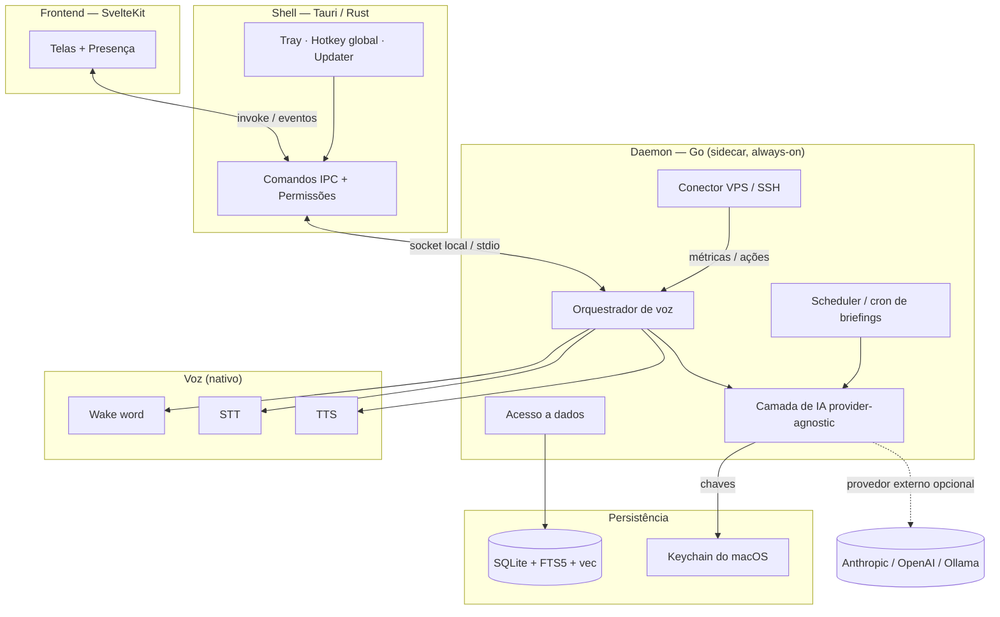
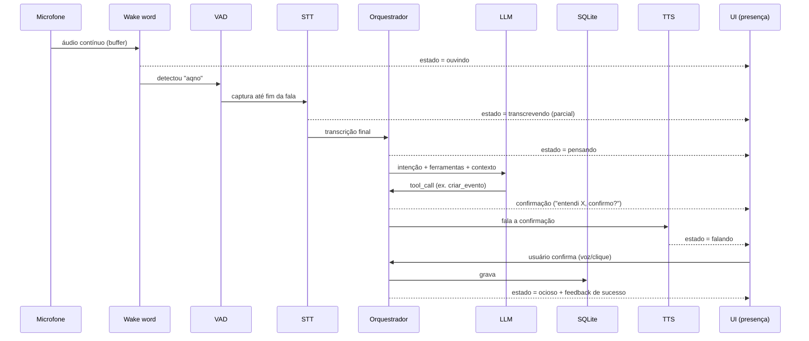
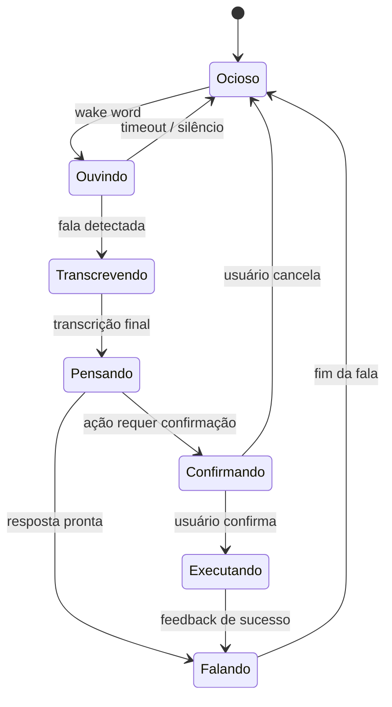
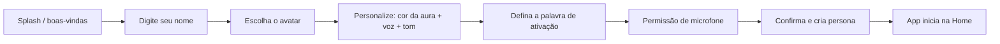
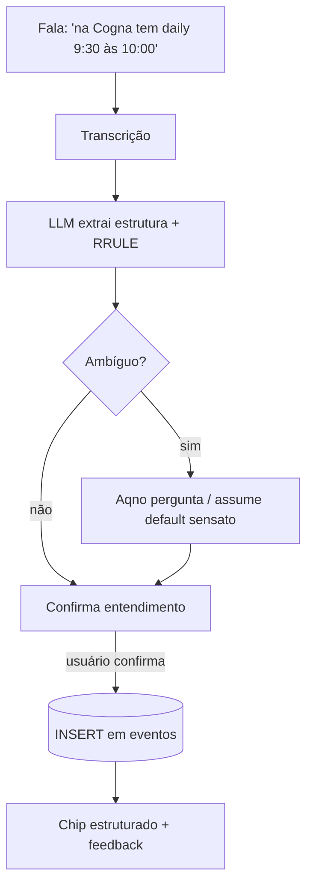
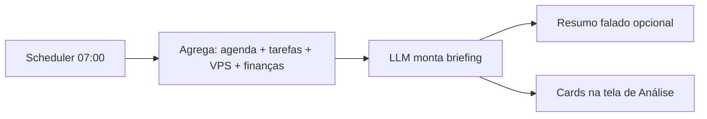
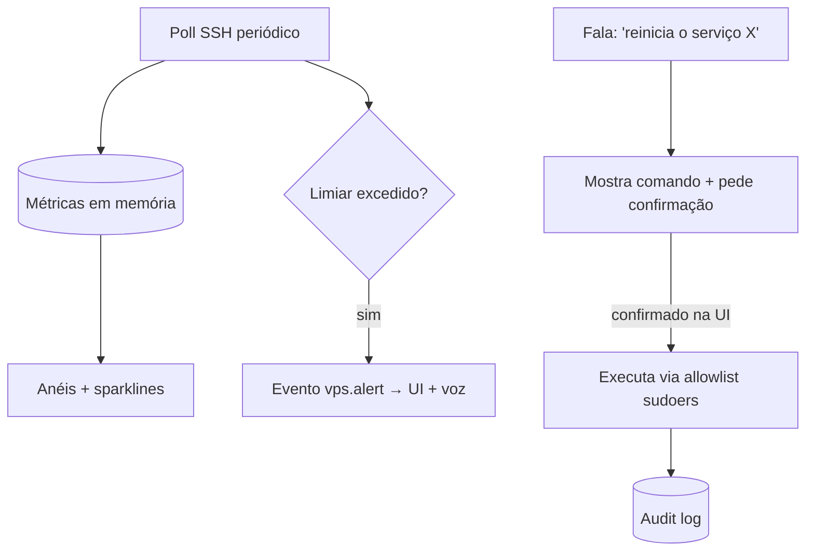

# Aqno — Documento de Arquitetura e Especificação Técnica

> Assistente pessoal de IA voice-first para desktop · `aqno.io`
> Versão do documento: 1.0 · Plataforma alvo inicial: macOS (Apple Silicon)

---

## Sumário

1. [Visão geral](#1-visão-geral)
2. [Princípios de produto](#2-princípios-de-produto)
3. [Stack tecnológica](#3-stack-tecnológica)
4. [Arquitetura em camadas](#4-arquitetura-em-camadas)
5. [Contrato de IPC (Tauri ⇄ Go)](#5-contrato-de-ipc-tauri--go)
6. [Camada de IA (provider-agnostic)](#6-camada-de-ia-provider-agnostic)
7. [Pipeline de voz](#7-pipeline-de-voz)
8. [Configuração de voz](#8-configuração-de-voz)
9. [Banco de dados local](#9-banco-de-dados-local)
10. [Modelo de dados (DDL)](#10-modelo-de-dados-ddl)
11. [Onboarding / primeiro uso](#11-onboarding--primeiro-uso)
12. [Fluxo do calendário](#12-fluxo-do-calendário)
13. [Fluxo de análise / briefing](#13-fluxo-de-análise--briefing)
14. [Fluxo de VPS / infraestrutura](#14-fluxo-de-vps--infraestrutura)
15. [Chat com contexto](#15-chat-com-contexto)
16. [Rede neural / grafo de conhecimento](#16-rede-neural--grafo-de-conhecimento)
17. [Segurança e isolamento de contexto](#17-segurança-e-isolamento-de-contexto)
18. [Estrutura de pastas do projeto](#18-estrutura-de-pastas-do-projeto)
19. [Roadmap de implementação](#19-roadmap-de-implementação)

---

## 1. Visão geral

Aqno é um companheiro de IA que vive na máquina do usuário e tem a **voz como interface primária**. O usuário fala; o Aqno registra, organiza, desenvolve e delibera demandas. A tela existe para **confirmar, revisar e dar presença** — não para ser preenchida manualmente.

Três pilares definem o produto:

- **Voice-first** — capturar, agendar e consultar por fala em linguagem natural, com confirmação inteligente.
- **Local-first** — dados moram na máquina; nuvem é opcional (backup e LLM de provedor externo, configurável). Isso permite isolar dados sensíveis de múltiplos contextos profissionais.
- **Mentor** — não é uma agenda passiva; observa carga de reuniões, protege foco, dá briefing diário e revisão semanal olhando vários contextos ao mesmo tempo.

O usuário-alvo inicial é um profissional que opera múltiplos contextos simultâneos (várias empresas/contratos) e precisa reduzir troca de contexto e evitar que demandas se percam.

---

## 2. Princípios de produto

| Princípio                               | Implicação de design                                                                                            |
| --------------------------------------- | --------------------------------------------------------------------------------------------------------------- |
| A voz é a interface, a tela é o espelho | Telas calmas, baixa densidade, feedback visual forte para cada estado de voz.                                   |
| Confirmar antes de agir                 | Toda ação que grava ou altera estado passa por um passo de confirmação (voz ou clique).                         |
| Reconhecer, não lembrar                 | O usuário escolhe entre opções visíveis; o sistema sugere e completa.                                           |
| Privado por padrão                      | Nada sai da máquina sem configuração explícita; chaves de API no Keychain, nunca no banco.                      |
| Presença reativa                        | O companheiro nomeado é o herói emocional; cada estado (ouvindo/pensando/falando) tem linguagem visual própria. |

---

## 3. Stack tecnológica

| Camada                | Tecnologia                                                                         | Papel                                                              |
| --------------------- | ---------------------------------------------------------------------------------- | ------------------------------------------------------------------ |
| Shell desktop         | **Tauri 2 (Rust)**                                                                 | Janela, tray, hotkey global, segurança, updater, empacotamento.    |
| Frontend              | **SvelteKit + TypeScript**                                                         | UI, telas, animações de presença, grafo.                           |
| Daemon                | **Go (sidecar binário)**                                                           | Núcleo always-on: voz, LLM, scheduler, SSH/VPS, lógica de domínio. |
| Banco                 | **SQLite** (via libSQL) + FTS5 + sqlite-vec                                        | Persistência local-first, busca e embeddings.                      |
| Voz                   | whisper.cpp / Apple Speech · Porcupine/openWakeWord · Piper/AVSpeech               | STT, wake word, TTS.                                               |
| IA                    | Camada própria provider-agnostic (Anthropic / OpenAI / OpenAI-compatible / Ollama) | Parsing, mentor, chat.                                             |
| Replicação (opcional) | Litestream → S3-compatible                                                         | Backup contínuo do SQLite.                                         |

**Divisão de responsabilidade entre Rust e Go.** O Rust (Tauri) é a casca fina e segura: comandos de IPC, permissões, janela, tray e atalhos globais. Todo o peso de domínio — pipeline de voz, chamadas de LLM, agendador, SSH para VPS — vive no **daemon Go**, que roda independente da janela e pode operar headless. O front Svelte nunca fala com o Go diretamente; fala com o Rust, que repassa.

---

## 4. Arquitetura em camadas



O daemon Go é o coração. Ele é iniciado pelo Tauri como sidecar e mantém:

- um **listener de voz** sempre ativo (wake word + VAD);
- o **orquestrador** que transforma fala em intenção e intenção em ação;
- um **scheduler** para tarefas proativas (briefing matinal, revisão semanal, alertas);
- a **camada de IA** que abstrai o provedor de LLM;
- o **acesso a dados** (SQLite) e o **conector de VPS**.

---

## 5. Contrato de IPC (Tauri ⇄ Go)

A comunicação entre o shell Rust e o daemon Go usa um socket local (Unix domain socket em `~/Library/Application Support/io.aqno/aqno.sock`) com mensagens JSON. Dois canais:

- **Request/response** — a UI pede algo (criar evento, listar dia, consultar VPS).
- **Eventos push** — o daemon empurra estados de voz e alertas para a UI em tempo real.

Envelope padrão:

```jsonc
// request (UI → daemon, via Rust)
{ "id": "req_01H...", "method": "calendar.create_event", "params": { /* ... */ } }

// response (daemon → UI)
{ "id": "req_01H...", "ok": true, "data": { /* ... */ } }
{ "id": "req_01H...", "ok": false, "error": { "code": "CONFLICT", "message": "..." } }

// evento push (daemon → UI, sem id de request)
{ "event": "voice.state", "data": { "state": "listening" } }
```

Métodos principais (versão 1):

| Método                                                   | Descrição                                      |
| -------------------------------------------------------- | ---------------------------------------------- |
| `app.bootstrap`                                          | Estado inicial: persona, contextos, config.    |
| `onboarding.complete`                                    | Finaliza primeiro uso (nome, avatar, persona). |
| `voice.start` / `voice.stop`                             | Liga/desliga escuta (push-to-talk).            |
| `voice.configure`                                        | Atualiza configs de voz.                       |
| `calendar.create_event` / `update` / `cancel_occurrence` | CRUD de eventos.                               |
| `calendar.query_range`                                   | Eventos expandidos (RRULE) de um intervalo.    |
| `tasks.*`                                                | CRUD de tarefas.                               |
| `chat.send`                                              | Envia mensagem ao LLM com contexto.            |
| `analysis.brief`                                         | Gera briefing do dia.                          |
| `vps.list` / `vps.metrics` / `vps.action`                | Infra.                                         |
| `graph.query`                                            | Nós e arestas do grafo.                        |
| `config.get` / `config.set`                              | Configuração.                                  |

Eventos push: `voice.state`, `voice.partial_transcript`, `voice.final_transcript`, `mentor.alert`, `vps.alert`.

---

## 6. Camada de IA (provider-agnostic)

O Aqno **não amarra** o usuário a um provedor. A escolha de modelo é configurável; o cliente define Anthropic, OpenAI, qualquer endpoint compatível com OpenAI, ou um modelo local via Ollama.

### 6.1 Abstração

No daemon Go, uma única interface esconde o provedor:

```go
type LLM interface {
    // Geração com suporte a tool-calling.
    Complete(ctx context.Context, req CompletionRequest) (CompletionResponse, error)
    // Streaming de tokens para o chat.
    Stream(ctx context.Context, req CompletionRequest) (<-chan Chunk, error)
    // Embeddings para o grafo / RAG.
    Embed(ctx context.Context, input []string) ([][]float32, error)
}

type CompletionRequest struct {
    System   string
    Messages []Message
    Tools    []Tool          // normalizado entre provedores
    JSONMode bool            // saída estruturada
    MaxTokens int
    Temperature float32
}
```

Implementações: `AnthropicProvider`, `OpenAIProvider`, `OpenAICompatibleProvider` (cobre Groq, OpenRouter, etc.), `OllamaProvider`. Cada uma adapta o formato de **tool-calling** próprio (Anthropic `tool_use` vs OpenAI `function calling` vs schema do Ollama) para o `Tool` interno.

### 6.2 Configuração (exposta na UI de Settings)

Persistida na tabela `config`; a **chave de API vai para o Keychain**, nunca para o SQLite.

```jsonc
{
  "llm.provider": "anthropic", // anthropic | openai | openai_compatible | ollama
  "llm.model": "<string-do-modelo>", // campo livre, definido pelo cliente
  "llm.base_url": "", // usado por openai_compatible / ollama
  "llm.max_tokens": 2000,
  "llm.temperature": 0.4,

  // Fallback / modo privado
  "llm.local_provider": "ollama",
  "llm.local_model": "<modelo-local>",
  "llm.embeddings_model": "<modelo-de-embeddings>"
}
```

> O `llm.model` é intencionalmente **string livre**: o usuário cola o identificador atual do provedor escolhido. Assim o Aqno não fica preso a uma geração específica de modelo e segue válido conforme os provedores lançam versões novas.

### 6.3 Roteamento por contexto (privacidade)

Cada contexto (empresa) pode forçar um modo de IA. Isso garante que dados sensíveis nunca saiam da máquina:

```jsonc
{
  "context.Visa.ai_mode": "local_only", // só Ollama, nada para a nuvem
  "context.Bayer.ai_mode": "local_only",
  "context.Pessoal.ai_mode": "cloud",
  "context.Pitrace.ai_mode": "cloud"
}
```

O orquestrador escolhe o provedor em runtime conforme o contexto ativo da fala/tarefa. Em `local_only`, qualquer tentativa de usar provedor de nuvem é bloqueada e registrada.

### 6.4 Tool-calling

O LLM recebe um conjunto de ferramentas internas e responde escolhendo qual chamar. Ferramentas da v1:

`criar_evento`, `cancelar_ocorrencia`, `consultar_agenda`, `criar_tarefa`, `concluir_tarefa`, `consultar_vps`, `executar_acao_vps` (com confirmação obrigatória), `buscar_memoria`, `registrar_nota`.

Exemplo de saída estruturada para a fala _"na Cogna tem uma nova daily todo dia das 9:30 às 10:00"_:

```json
{
  "tool": "criar_evento",
  "args": {
    "contexto": "Cogna",
    "titulo": "Daily",
    "tipo": "reuniao",
    "inicio": "09:30",
    "fim": "10:00",
    "rrule": "FREQ=WEEKLY;BYDAY=MO,TU,WE,TH,FR"
  }
}
```

---

## 7. Pipeline de voz

A voz é o caminho crítico. O fluxo roda quase todo no daemon Go, com bibliotecas nativas para as partes pesadas.

### 7.1 Fluxo ponta a ponta



### 7.2 Componentes

- **Captura de áudio**: stream contínuo do microfone em buffer circular (baixa latência, ~16 kHz mono).
- **Wake word**: detecção on-device de "aqno" (ou palavra custom). Opções: Porcupine (treina keyword custom, bindings Go/Rust) ou openWakeWord/sherpa-onnx (open-source, ONNX). Roda barato em background.
- **VAD (Voice Activity Detection)**: após o wake word, detecta início/fim da fala para saber quando parar de gravar (Silero VAD ou WebRTC VAD).
- **STT**: transcrição. Dois caminhos:
  - **whisper.cpp** via binding cgo, com aceleração Metal no Apple Silicon — portável e privado.
  - **Apple `SFSpeechRecognizer`** (on-device) via helper Swift — qualidade alta, zero modelo para empacotar; porém Mac-only.
- **Orquestrador**: monta o prompt com as ferramentas disponíveis e o contexto ativo, chama o LLM, interpreta o tool-call.
- **Confirmação**: para qualquer ação que grava/altera, o Aqno repete o entendimento e espera confirmação.
- **TTS**: resposta falada. Piper (local, cross-platform) ou Apple `AVSpeechSynthesis`.

### 7.3 Máquina de estados da presença



Cada estado tem representação visual no orbe de presença (respira no ocioso, ripples no ouvindo, shimmer no pensando, waveform no falando). Eventos `voice.state` empurram a mudança para a UI.

### 7.4 Orçamento de latência (alvo, M-series)

| Etapa                           | Alvo                            |
| ------------------------------- | ------------------------------- |
| Wake word → início da captura   | < 200 ms                        |
| Fim da fala → transcrição final | < 800 ms                        |
| Transcrição → tool-call do LLM  | 0,5–2,5 s (depende do provedor) |
| Início da resposta falada (TTS) | < 400 ms                        |

Para reduzir a latência percebida, a UI mostra transcrição parcial e o estado "pensando" assim que a fala termina.

---

## 8. Configuração de voz

Tela de Settings → Voz. Tudo persistido em `config` e aplicado ao vivo via `voice.configure`.

| Configuração               | Opções                               | Padrão            |
| -------------------------- | ------------------------------------ | ----------------- |
| Palavra de ativação        | livre (ex.: "aqno", "mega brain")    | `aqno`            |
| Modo de ativação           | wake word · push-to-talk · ambos     | ambos             |
| Atalho push-to-talk        | hotkey global configurável           | ⌥ Space           |
| Sensibilidade do wake word | baixa · média · alta                 | média             |
| Idioma do STT              | pt-BR · en-US · auto                 | pt-BR             |
| Motor de STT               | local (whisper) · Apple · automático | automático        |
| Voz do TTS                 | lista de vozes disponíveis           | (1ª voz pt-BR)    |
| Velocidade da fala         | 0.8×–1.4×                            | 1.0×              |
| Tom da personalidade       | amigável · direto · formal           | amigável          |
| Confirmação por voz        | sempre · só em ações destrutivas     | só destrutivas    |
| Dispositivo de entrada     | seletor de microfone                 | padrão do sistema |
| Privacidade do STT         | sempre local · permite nuvem         | sempre local      |
| Som de feedback            | ligado · desligado                   | ligado            |

Em **modo privado** (STT sempre local), nenhum áudio é enviado para fora; a transcrição acontece 100% on-device.

---

## 9. Banco de dados local

**Recomendação: SQLite** (via **libSQL**, o fork moderno do SQLite mantido pela Turso), com as extensões **FTS5** (busca full-text) e **sqlite-vec** (busca vetorial). É a escolha certa para o pedido "bonito, rápido, leve e que suporte muita informação":

- **Leve e embarcado**: um único arquivo, zero servidor, abre instantâneo. Cabe perfeitamente num app desktop.
- **Rápido**: leitura local sem round-trip de rede; com **WAL mode** ligado, leituras e escritas concorrentes ficam suaves.
- **Suporta muita informação**: SQLite lida com bancos de muitos GB sem suar; índices certos mantêm as queries rápidas mesmo com anos de histórico.
- **Busca de verdade**: FTS5 dá busca textual rápida sobre notas, mensagens e eventos.
- **Pronto para IA**: sqlite-vec guarda embeddings e faz busca por similaridade — base do grafo de conhecimento e do RAG do chat, tudo dentro do mesmo arquivo.
- **Backup trivial**: Litestream replica continuamente o arquivo para um bucket S3-compatible (o seu próprio storage), sem virar dependência de runtime.

Configuração recomendada (PRAGMAs):

```sql
PRAGMA journal_mode = WAL;       -- concorrência de leitura/escrita
PRAGMA synchronous = NORMAL;     -- bom equilíbrio durabilidade/velocidade
PRAGMA foreign_keys = ON;
PRAGMA busy_timeout = 5000;
PRAGMA cache_size = -20000;      -- ~20 MB de cache
```

Localização do arquivo: `~/Library/Application Support/io.aqno/aqno.db` (+ `aqno.db-wal`, `aqno.db-shm`).

> **Por que não Postgres/DuckDB?** Postgres exige servidor — peso desnecessário num app pessoal local-first. DuckDB é excelente para analytics colunar, mas o Aqno é majoritariamente transacional (eventos, tarefas, mensagens); SQLite é o ajuste certo. Se um dia o produto virar B2B com sync multi-dispositivo, libSQL/Turso já oferece o caminho de réplica gerenciada sem trocar de banco.

---

## 10. Modelo de dados (DDL)

```sql
-- ===== Configuração e persona =====
CREATE TABLE config (
  chave         TEXT PRIMARY KEY,
  valor         TEXT NOT NULL,
  atualizado_em TEXT NOT NULL DEFAULT (datetime('now'))
);

CREATE TABLE persona (
  id          INTEGER PRIMARY KEY,
  nome        TEXT NOT NULL,                 -- nome do companheiro
  tipo_avatar TEXT NOT NULL,                 -- orbe | animal | personagem | imagem
  avatar_ref  TEXT,                          -- id do preset OU caminho do arquivo
  cor_aura    TEXT NOT NULL DEFAULT '#8B5CF6',
  voz         TEXT,                          -- id da voz TTS
  tom         TEXT NOT NULL DEFAULT 'amigavel',
  wake_word   TEXT NOT NULL DEFAULT 'aqno',
  criado_em   TEXT NOT NULL DEFAULT (datetime('now'))
);

-- ===== Contextos (empresas + pessoal) =====
CREATE TABLE contextos (
  id        INTEGER PRIMARY KEY,
  nome      TEXT NOT NULL UNIQUE,            -- Cogna, Visa, Bayer, Devlith, Pitrace, Pessoal
  cor       TEXT NOT NULL,
  ai_mode   TEXT NOT NULL DEFAULT 'cloud',   -- cloud | local_only
  arquivado INTEGER NOT NULL DEFAULT 0,
  criado_em TEXT NOT NULL DEFAULT (datetime('now'))
);

-- ===== Calendário =====
CREATE TABLE eventos (
  id          INTEGER PRIMARY KEY,
  contexto_id INTEGER NOT NULL REFERENCES contextos(id),
  titulo      TEXT NOT NULL,
  tipo        TEXT NOT NULL DEFAULT 'reuniao', -- reuniao | bloco_foco | tarefa | pessoal
  inicio      TEXT NOT NULL,                   -- 'HH:MM' (recorrente) ou ISO (único)
  fim         TEXT,
  rrule       TEXT,                            -- iCalendar RRULE; NULL = evento único
  data_unica  TEXT,                            -- 'YYYY-MM-DD' para não recorrente
  lembrete_min INTEGER,                        -- minutos antes
  ativo       INTEGER NOT NULL DEFAULT 1,
  origem_voz  TEXT,                            -- frase original (auditoria/confiança)
  criado_em   TEXT NOT NULL DEFAULT (datetime('now'))
);

CREATE TABLE excecoes (
  id          INTEGER PRIMARY KEY,
  evento_id   INTEGER NOT NULL REFERENCES eventos(id) ON DELETE CASCADE,
  data        TEXT NOT NULL,                   -- ocorrência afetada
  tipo        TEXT NOT NULL DEFAULT 'cancelado', -- cancelado | remarcado
  novo_inicio TEXT,
  novo_fim    TEXT
);

-- ===== Tarefas =====
CREATE TABLE tarefas (
  id          INTEGER PRIMARY KEY,
  contexto_id INTEGER REFERENCES contextos(id),
  titulo      TEXT NOT NULL,
  status      TEXT NOT NULL DEFAULT 'aberta',  -- aberta | em_andamento | concluida
  prioridade  INTEGER NOT NULL DEFAULT 0,
  prazo       TEXT,
  origem_voz  TEXT,
  criado_em   TEXT NOT NULL DEFAULT (datetime('now')),
  concluido_em TEXT
);

-- ===== Interações de voz (histórico) =====
CREATE TABLE interacoes (
  id          INTEGER PRIMARY KEY,
  contexto_id INTEGER REFERENCES contextos(id),
  transcricao TEXT NOT NULL,
  intencao    TEXT,                            -- tool escolhida
  resultado   TEXT,                            -- resumo do que aconteceu
  criado_em   TEXT NOT NULL DEFAULT (datetime('now'))
);

-- ===== Chat =====
CREATE TABLE conversas (
  id        INTEGER PRIMARY KEY,
  titulo    TEXT,
  criado_em TEXT NOT NULL DEFAULT (datetime('now'))
);

CREATE TABLE mensagens (
  id          INTEGER PRIMARY KEY,
  conversa_id INTEGER NOT NULL REFERENCES conversas(id) ON DELETE CASCADE,
  papel       TEXT NOT NULL,                   -- user | assistant | tool
  conteudo    TEXT NOT NULL,
  criado_em   TEXT NOT NULL DEFAULT (datetime('now'))
);

-- ===== Grafo de conhecimento =====
CREATE TABLE entidades (
  id        INTEGER PRIMARY KEY,
  tipo      TEXT NOT NULL,                     -- empresa | projeto | tarefa | evento | pessoa | decisao | nota
  rotulo    TEXT NOT NULL,
  contexto_id INTEGER REFERENCES contextos(id),
  meta      TEXT,                              -- JSON livre
  criado_em TEXT NOT NULL DEFAULT (datetime('now'))
);

CREATE TABLE relacoes (
  id        INTEGER PRIMARY KEY,
  origem_id INTEGER NOT NULL REFERENCES entidades(id) ON DELETE CASCADE,
  destino_id INTEGER NOT NULL REFERENCES entidades(id) ON DELETE CASCADE,
  tipo      TEXT NOT NULL,                     -- pertence_a | depende_de | mencionou | etc.
  peso      REAL NOT NULL DEFAULT 1.0
);

-- ===== Servidores / VPS =====
CREATE TABLE servidores (
  id          INTEGER PRIMARY KEY,
  nome        TEXT NOT NULL,
  host        TEXT NOT NULL,
  porta       INTEGER NOT NULL DEFAULT 22,
  usuario     TEXT NOT NULL,
  -- credenciais NÃO ficam aqui; referência ao item do Keychain
  keychain_ref TEXT NOT NULL,
  criado_em   TEXT NOT NULL DEFAULT (datetime('now'))
);

-- ===== Busca (FTS5) =====
CREATE VIRTUAL TABLE busca USING fts5(
  tipo, ref_id UNINDEXED, texto
);

-- ===== Embeddings (sqlite-vec) =====
CREATE VIRTUAL TABLE vec_memoria USING vec0(
  entidade_id INTEGER PRIMARY KEY,
  embedding   FLOAT[768]
);

-- ===== Índices =====
CREATE INDEX idx_eventos_contexto ON eventos(contexto_id);
CREATE INDEX idx_eventos_ativo     ON eventos(ativo);
CREATE INDEX idx_tarefas_status    ON tarefas(status);
CREATE INDEX idx_mensagens_conversa ON mensagens(conversa_id);
CREATE INDEX idx_relacoes_origem   ON relacoes(origem_id);
CREATE INDEX idx_relacoes_destino  ON relacoes(destino_id);
```

---

## 11. Onboarding / primeiro uso

Na primeira abertura, o app conduz um fluxo curto e encantador antes de iniciar. É o momento de criar vínculo com o companheiro.



Passos:

1. **Boas-vindas** — apresentação curta do Aqno e do conceito de voz.
2. **Nome** — o usuário digita o próprio nome (e, na sequência, dá um **nome ao companheiro**).
3. **Avatar** — escolhe a forma: **orbe abstrata**, **animal**, **personagem** de uma galeria de presets, ou **upload de imagem própria**. A imagem custom é copiada para `~/Library/Application Support/io.aqno/avatars/`.
4. **Personalização** — cor da aura (paleta roxa por padrão), voz do TTS e tom (amigável/direto/formal), com preview reagindo à voz.
5. **Palavra de ativação** — padrão "aqno", editável.
6. **Permissão de microfone** — solicita acesso; explica que o áudio é processado localmente.
7. **Confirmação** — grava em `persona` e marca `config['onboarding.completed'] = true`; o app transiciona para a Home.

Em aberturas seguintes, o app pula direto para a Home (checando `onboarding.completed`).

---

## 12. Fluxo do calendário

### 12.1 Criação por voz



Regras de interpretação aplicadas pelo LLM:

- "todo dia" no contexto de reunião de trabalho → `BYDAY=MO,TU,WE,TH,FR` (dias úteis), confirmando com o usuário.
- Datas relativas ("amanhã", "toda terça") resolvidas com base na data atual.
- Sempre grava `origem_voz` para auditoria e para o usuário poder corrigir falando.

### 12.2 Visualização

- **Segmented control**: dia · semana · mês.
- Eventos coloridos por contexto (empresa).
- **Expansão de RRULE**: `calendar.query_range` recebe um intervalo, expande as regras recorrentes em ocorrências concretas, aplica `excecoes` (cancelamentos/remarcações) e devolve a lista pronta.
- Painel lateral de detalhe ao clicar num evento.

### 12.3 Detecção de conflito e foco

- Ao criar/mover, o daemon checa sobreposição com eventos existentes e avisa.
- O mentor identifica dias sem janela de foco e oferece reservar um `bloco_foco`.

### 12.4 Exportação (futuro)

Como o armazenamento usa RRULE padrão (iCalendar), exportar para `.ics` ou sincronizar com Google/Outlook é uma extensão natural, sem migração de dados.

---

## 13. Fluxo de análise / briefing

A tela de Análise é o painel de assistente pessoal. O scheduler do daemon gera dois artefatos por padrão:

- **Briefing matinal** (ex.: 07:00) — junta agenda do dia, tarefas pendentes, saúde das aplicações/VPS, lembretes e 1 conselho do mentor. Pode ser falado.
- **Revisão semanal** — carga de reuniões vs média, foco protegido, demandas que ficaram para trás.

Composição da tela: cards glanceáveis com mini-gráficos e anéis de progresso, agrupados por contexto, mais um callout de "conselho do mentor". A geração usa a camada de IA respeitando o `ai_mode` de cada contexto.



---

## 14. Fluxo de VPS / infraestrutura

O daemon Go conecta via SSH aos servidores cadastrados (credenciais no Keychain, referência em `servidores.keychain_ref`).

Capacidades v1 (somente leitura primeiro):

- Lista de containers e status.
- Medidores de CPU/RAM/disco (anéis + sparklines).
- Tail de logs.
- Métricas ao vivo (poll periódico).

Ações de escrita (reiniciar serviço, recriar container) seguem **regra de confirmação obrigatória**: o Aqno mostra/fala o comando exato, e só executa após confirmação explícita. Tudo é registrado em log de auditoria. Operações destrutivas exigem confirmação **na UI**, não por voz.



---

## 15. Chat com contexto

Thread estilo ChatGPT, mas com **memória e contexto do que o Aqno já sabe**:

- Chips de contexto indicam o que está em jogo ("sabe do seu dia", "conectado à VPS", contexto/empresa ativo).
- O daemon injeta contexto relevante via **RAG**: busca em `vec_memoria` (embeddings) + `busca` (FTS5) os itens mais pertinentes (eventos, decisões, notas, interações) e os adiciona ao prompt.
- Entrada por voz e texto; a presença do companheiro mostra o estado "falando" durante o streaming.
- Histórico persistido em `conversas`/`mensagens`.

---

## 16. Rede neural / grafo de conhecimento

Visão force-directed (estilo Obsidian) das entidades e suas relações: empresas, projetos, tarefas, eventos, pessoas e decisões.

- **Dados**: `entidades` (nós) e `relacoes` (arestas).
- **Render**: usar WebGL/canvas (ex.: sigma.js ou d3-force em canvas) — **não** milhares de nós em SVG, por performance na WKWebView.
- **Interação**: zoom/pan, hover no nó → detalhe, filtro por contexto, clusters coloridos por contexto.
- **Construção**: à medida que o usuário fala e o Aqno registra coisas, entidades e relações são criadas/atualizadas automaticamente; embeddings alimentam `vec_memoria` para conectar itens semanticamente relacionados.

---

## 17. Segurança e isolamento de contexto

Como o usuário opera múltiplas empresas (algumas com NDA e dados sensíveis), o isolamento é requisito, não detalhe.

- **Chaves e credenciais no Keychain do macOS** — nunca em texto plano no SQLite. O banco guarda apenas referências.
- **`ai_mode` por contexto** — contextos marcados `local_only` (ex.: Visa, Bayer) nunca enviam dados para provedores de nuvem; usam apenas o LLM local.
- **Modo privado de STT** — transcrição 100% on-device quando configurado.
- **Audit log** de toda ação em VPS e de qualquer chamada que cruze a fronteira local→nuvem.
- **Confirmação obrigatória** para ações destrutivas, com operações sérias exigindo confirmação na UI.
- **Replicação opcional e criptografada** — Litestream para o storage do próprio usuário; backup é escolha, não padrão.

---

## 18. Estrutura de pastas do projeto

> Estado atual do repositório (fase 0 — esqueleto). Módulos como `voice/`, `llm/`, `store/` etc. descritos nas seções anteriores são o desenho alvo; ainda não existem como pacotes no daemon.

```
aqno/                          # raiz do repositório (pasta `app/`)
├── package.json               # scripts pnpm (dev, tauri, daemon:sidecar, app:dev, …)
├── vite.config.ts
├── svelte.config.js
├── tsconfig.json
├── README.md
│
├── scripts/
│   └── build-sidecar.mjs      # compila o daemon Go e nomeia para o triple do Rust
│
├── src-tauri/                 # Shell Rust (Tauri 2)
│   ├── src/
│   │   ├── main.rs            # entrypoint → aqno_lib::run()
│   │   └── lib.rs             # spawn do sidecar, IPC daemon_url, evento daemon-ready
│   ├── binaries/              # artefatos do aqnod (gitignored; ver README)
│   │   └── README.md
│   ├── capabilities/
│   │   └── default.json
│   ├── icons/                 # ícones do app
│   ├── build.rs
│   ├── tauri.conf.json
│   └── Cargo.toml
│
├── src/                       # Frontend SvelteKit
│   ├── app.html
│   ├── app.css                # estilos globais
│   ├── lib/
│   │   ├── components/        # Presence, VoiceBar, Card, GraphView, ChatBubble, Sidebar, …
│   │   ├── stores/            # presence.ts, voice.ts
│   │   ├── styles/
│   │   │   └── tokens.css     # design system (tokens)
│   │   ├── api.ts             # cliente HTTP tipado para o daemon
│   │   ├── tauri.ts           # bridge Tauri (invoke + eventos)
│   │   └── types.ts           # tipos compartilhados da UI
│   ├── routes/
│   │   ├── +layout.svelte
│   │   ├── +layout.ts
│   │   ├── +page.svelte       # Home / companheiro
│   │   ├── persona/           # onboarding / configuração da persona
│   │   ├── agenda/
│   │   ├── analise/
│   │   ├── vps/
│   │   ├── chat/
│   │   └── rede/              # grafo de conhecimento
│   └── static/
│       └── favicon.png
│
├── daemon/                    # Daemon Go (sidecar `aqnod`)
│   ├── main.go                # servidor HTTP (REST + SSE), handshake AQNOD_LISTENING
│   ├── data.go                # fixtures / dados mock para a UI
│   └── go.mod
│
└── docs/
    └── context.md             # este documento
```

---

## 19. Roadmap de implementação

| Fase                     | Entrega                                                                                               | Critério de pronto                                                |
| ------------------------ | ----------------------------------------------------------------------------------------------------- | ----------------------------------------------------------------- |
| **0 — Esqueleto**        | Tauri + Svelte + daemon Go conversando via socket; SQLite criado; onboarding (nome + avatar).         | App abre, cria persona, persiste e reabre na Home.                |
| **1 — Voz**              | Wake word + STT local + TTS + máquina de estados de presença. Comando read-only ("como tá meu dia?"). | Criar evento por voz com confirmação em < 10 s e > 95% de acerto. |
| **2 — Calendário**       | CRUD por voz com RRULE, views dia/semana/mês, conflitos, contextos coloridos.                         | Eventos recorrentes corretos e isolados por contexto.             |
| **3 — IA configurável**  | Camada provider-agnostic com Settings (Anthropic/OpenAI/compatible/Ollama) + roteamento por contexto. | Trocar de provedor sem tocar em código; `local_only` respeitado.  |
| **4 — Análise / mentor** | Briefing matinal e revisão semanal; tela de Análise.                                                  | Briefing falado de manhã agregando múltiplos contextos.           |
| **5 — VPS**              | Conexão SSH read-only, métricas, alertas; ações com confirmação.                                      | Métricas ao vivo + alerta proativo de limiar.                     |
| **6 — Chat + grafo**     | Chat com RAG (FTS5 + vec) e grafo force-directed.                                                     | Chat referencia memória; grafo navegável por contexto.            |

---

> **Nota sobre modelos de IA.** Este documento mantém a escolha de modelo **aberta e configurável** de propósito. O campo `llm.model` é uma string livre definida pelo usuário, e a camada de abstração suporta Anthropic, OpenAI, qualquer endpoint compatível com a API da OpenAI e modelos locais via Ollama. Consulte a documentação do provedor escolhido para o identificador de modelo atual no momento da configuração.
