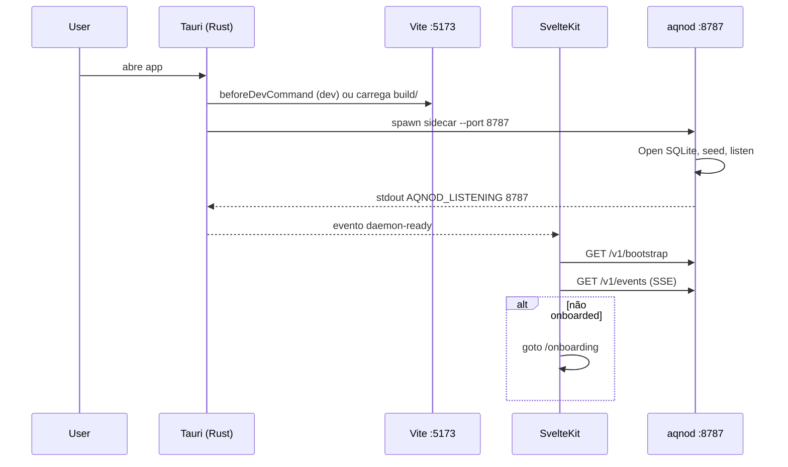
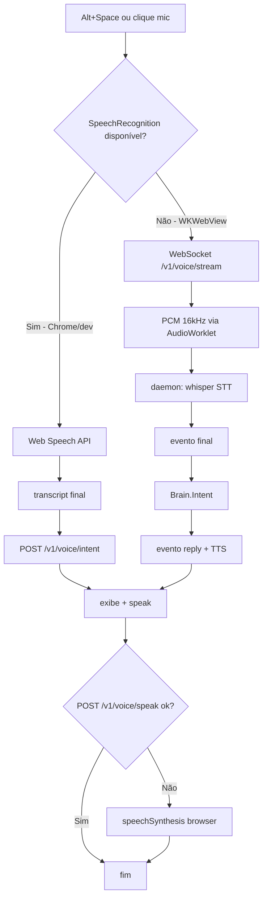
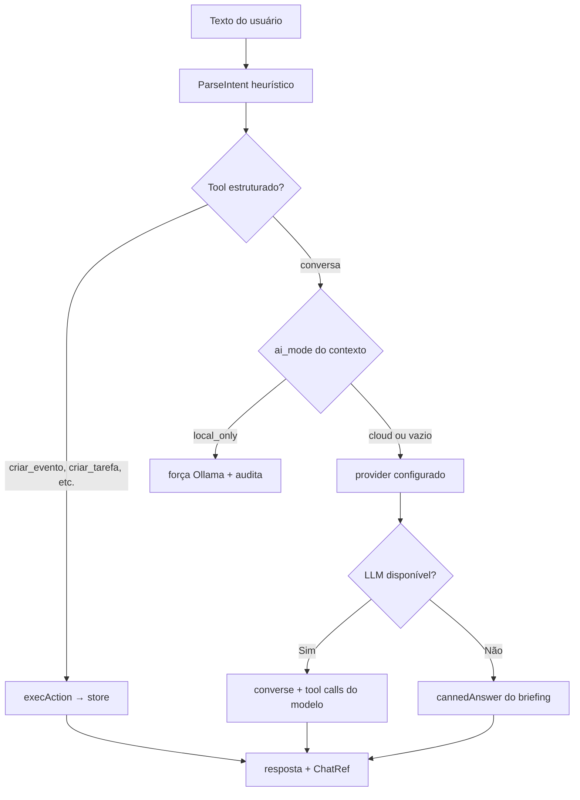
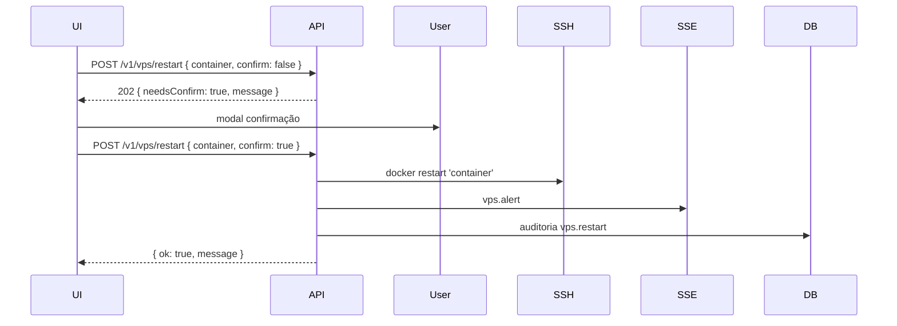
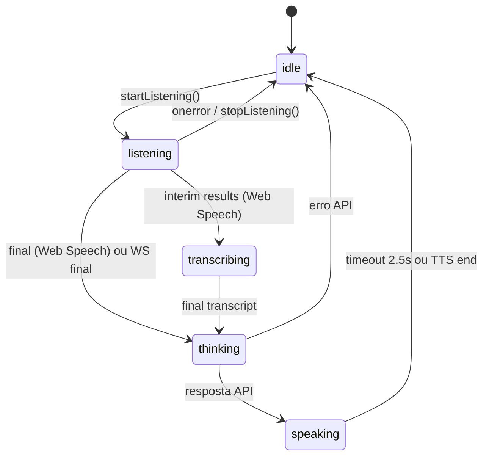
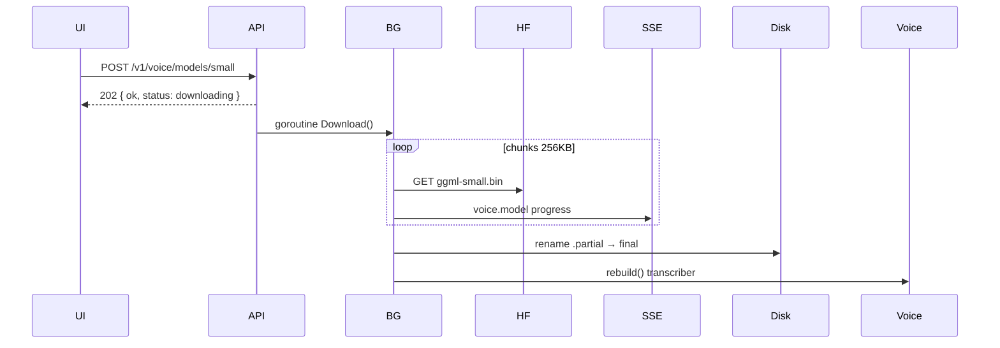
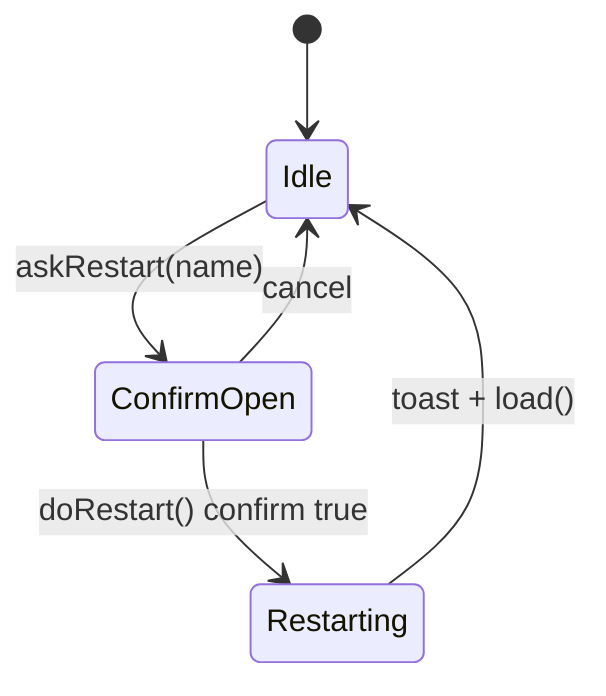
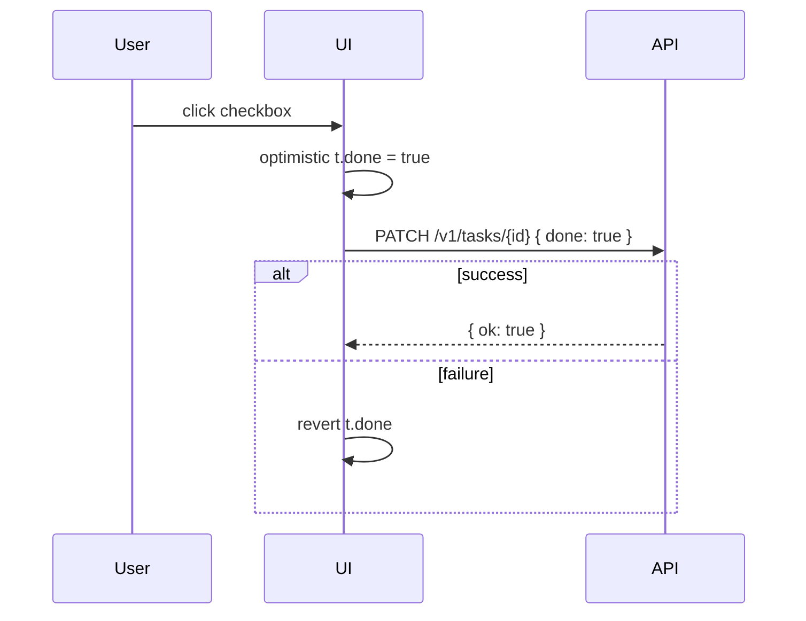
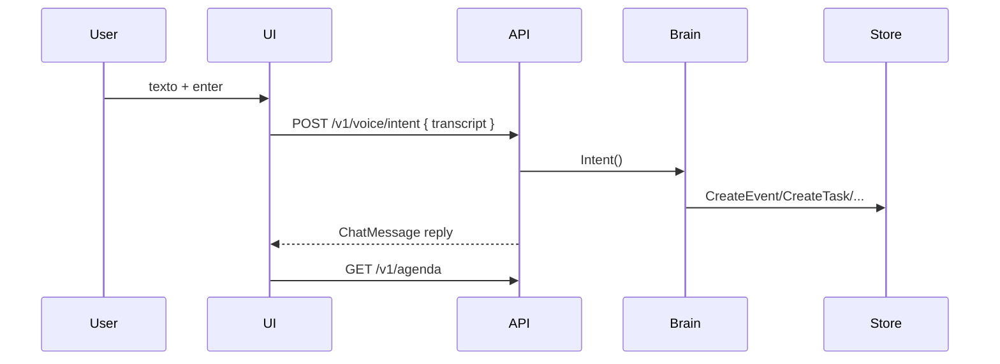
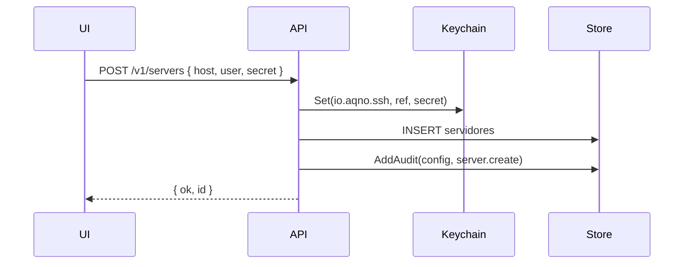

# Aqno — Contexto da Aplicação (Estado Atual)

> Documento de referência sobre **como o projeto está hoje** — stack, integrações, fluxos, contratos de dados, o que funciona e o que ainda é placeholder.  
> Versão do app: **0.1.0** · Daemon: **0.2.0** · Atualizado em: junho/2026  
> **Escopo:** ~3.700 linhas · **78 seções** · cobre frontend, daemon, Tauri, API, UI, tipos, testes, roadmap e ops.  
> Para a especificação de produto e roadmap, ver [`context.md`](./context.md).

---

## Sumário

1. [O que é o Aqno](#1-o-que-é-o-aqno)
2. [Stack tecnológica](#2-stack-tecnológica)
3. [Arquitetura em três camadas](#3-arquitetura-em-três-camadas)
4. [Como as camadas se integram](#4-como-as-camadas-se-integram)
5. [Frontend (SvelteKit)](#5-frontend-sveltekit)
6. [Daemon Go (`aqnod`)](#6-daemon-go-aqnod)
7. [Shell Tauri (Rust)](#7-shell-tauri-rust)
8. [Banco de dados local](#8-banco-de-dados-local)
9. [Camada de IA (LLM)](#9-camada-de-ia-llm)
10. [Pipeline de voz](#10-pipeline-de-voz)
11. [VPS / SSH](#11-vps--ssh)
12. [Segurança e privacidade](#12-segurança-e-privacidade)
13. [Design system](#13-design-system)
14. [Tooling e qualidade de código](#14-tooling-e-qualidade-de-código)
15. [Como rodar](#15-como-rodar)
16. [O que funciona vs. o que é placeholder](#16-o-que-funciona-vs-o-que-é-placeholder)
17. [Estrutura de pastas](#17-estrutura-de-pastas)
18. [Mapa completo da API REST](#18-mapa-completo-da-api-rest)
19. [Chaves de configuração](#19-chaves-de-configuração)
20. [Contratos JSON e exemplos de payload](#20-contratos-json-e-exemplos-de-payload)
21. [Fluxos end-to-end](#21-fluxos-end-to-end)
22. [Detalhamento por tela](#22-detalhamento-por-tela)
23. [Intent parser (voz e texto)](#23-intent-parser-voz-e-texto)
24. [Calendário, RRULE e conflitos](#24-calendário-rrule-e-conflitos)
25. [Componentes do design system](#25-componentes-do-design-system)
26. [Testes automatizados](#26-testes-automatizados)
27. [Variáveis de ambiente e flags de build](#27-variáveis-de-ambiente-e-flags-de-build)
28. [Espelhamento Go ↔ TypeScript](#28-espelhamento-go--typescript)
29. [Limitações conhecidas e dívidas técnicas](#29-limitações-conhecidas-e-dívidas-técnicas)
30. [Glossário](#30-glossário)
31. [Inventário da camada Store](#31-inventário-da-camada-store)
32. [Providers LLM — implementação por vendor](#32-providers-llm--implementação-por-vendor)
33. [Brain real vs fallbackBrain](#33-brain-real-vs-fallbackbrain)
34. [Anatomia do componente Presence](#34-anatomia-do-componente-presence)
35. [Catálogo de ícones e tipografia](#35-catálogo-de-ícones-e-tipografia)
36. [Grafo de conhecimento — layout e UI](#36-grafo-de-conhecimento--layout-e-ui)
37. [Referência completa `api.ts`](#37-referência-completa-apits)
38. [Máquina de estados de voz (frontend)](#38-máquina-de-estados-de-voz-frontend)
39. [Modos de build STT (whisper)](#39-modos-de-build-stt-whisper)
40. [Build, bundle e artefatos Tauri](#40-build-bundle-e-artefatos-tauri)
41. [Matriz de compatibilidade (browser vs desktop)](#41-matriz-de-compatibilidade-browser-vs-desktop)
42. [Auditoria, interações e histórico](#42-auditoria-interações-e-histórico)
43. [Decisões de arquitetura (registro)](#43-decisões-de-arquitetura-registro)
44. [Troubleshooting e FAQ de desenvolvimento](#44-troubleshooting-e-faq-de-desenvolvimento)
45. [Checklist de validação manual](#45-checklist-de-validação-manual)
46. [Catálogo detalhado de componentes UI](#46-catálogo-detalhado-de-componentes-ui)
47. [Wizard de onboarding (passo a passo)](#47-wizard-de-onboarding-passo-a-passo)
48. [Layout shell e padrões de página](#48-layout-shell-e-padrões-de-página)
49. [Lógica do mentor e briefings](#49-lógica-do-mentor-e-briefings)
50. [Roadmap vs estado atual (matriz de fases)](#50-roadmap-vs-estado-atual-matriz-de-fases)
51. [Validação e erros da API HTTP](#51-validação-e-erros-da-api-http)
52. [Referência SQL (queries principais)](#52-referência-sql-queries-principais)
53. [Download de modelos whisper (protocolo)](#53-download-de-modelos-whisper-protocolo)
54. [Inventário de arquivos do repositório](#54-inventário-de-arquivos-do-repositório)
55. [Configuração TypeScript, ESLint e Prettier](#55-configuração-typescript-eslint-e-prettier)
56. [Scripts npm e Makefile (referência completa)](#56-scripts-npm-e-makefile-referência-completa)
57. [Diagramas de dados por tela](#57-diagramas-de-dados-por-tela)
58. [Performance, limites e capacidade](#58-performance-limites-e-capacidade)
59. [Personas de usuário e cenários de uso](#59-personas-de-usuário-e-cenários-de-uso)
60. [Evolução recomendada (próximos commits)](#60-evolução-recomendada-próximos-commits)
61. [Tipos TypeScript — referência campo a campo](#61-tipos-typescript--referência-campo-a-campo)
62. [Tipos Go (`model`) — referência campo a campo](#62-tipos-go-model--referência-campo-a-campo)
63. [Tela Início (`/`) — implementação detalhada](#63-tela-início--implementação-detalhada)
64. [Tela Agenda (`/agenda`) — implementação detalhada](#64-tela-agenda-agenda--implementação-detalhada)
65. [Tela Chat (`/chat`) — implementação detalhada](#65-tela-chat-chat--implementação-detalhada)
66. [Tela VPS (`/vps`) — implementação detalhada](#66-tela-vps-vps--implementação-detalhada)
67. [Tela Análise (`/analise`) — implementação detalhada](#67-tela-análise-analise--implementação-detalhada)
68. [Catálogo de testes Go (assertions)](#68-catálogo-de-testes-go-assertions)
69. [Constantes, limites e números do código](#69-constantes-limites-e-números-do-código)
70. [Paleta de cores — referência hex](#70-paleta-de-cores--referência-hex)
71. [API REST — catálogo request/response completo](#71-api-rest--catálogo-requestresponse-completo)
72. [Git, commits e hooks](#72-git-commits-e-hooks)
73. [Artefatos ignorados e outputs de build](#73-artefatos-ignorados-e-outputs-de-build)
74. [Dependências pinadas (versões exatas)](#74-dependências-pinadas-versões-exatas)
75. [Diagramas de sequência adicionais](#75-diagramas-de-sequência-adicionais)
76. [Mapeamento evento DB → JSON → UI](#76-mapeamento-evento-db--json--ui)
77. [Keyboard, acessibilidade e UX copy](#77-keyboard-acessibilidade-e-ux-copy)
78. [Índice alfabético rápido](#78-índice-alfabético-rápido)

---

## 1. O que é o Aqno

**Aqno** é um companheiro de IA pessoal **voice-first** para desktop. A voz é a interface primária; a tela serve para confirmar, revisar e dar presença visual ao assistente.

O produto é pensado para profissionais que operam **múltiplos contextos** simultâneos (várias empresas/contratos) e precisam de um mentor que organize agenda, tarefas, infraestrutura e memória — tudo **local-first**, com nuvem opcional para LLM e backup.

### Princípios de produto (implementados na UI)

| Princípio               | Como aparece hoje                                                                                  |
| ----------------------- | -------------------------------------------------------------------------------------------------- |
| Voice-first             | VoiceBar fixa no rodapé; hotkey Alt+Space; estados visuais de presença                             |
| Confirmar antes de agir | Restart de container VPS exige `confirm: true`; intents destrutivos planejados com `voice.confirm` |
| Local-first             | SQLite local; chaves no Keychain; `ai_mode: local_only` por contexto                               |
| Múltiplos contextos     | Chips na sidebar; eventos/tarefas vinculados a contexto; grafo por empresa                         |
| Presença reativa        | Componente `Presence` com animações por estado (`idle` → `listening` → `thinking` → `speaking`)    |

### Estado atual do repositório

O esqueleto desktop está **funcional end-to-end**:

- **9 rotas** SvelteKit ligadas ao daemon via REST + SSE + WebSocket
- Daemon persiste em **SQLite real** com seed idempotente de demo
- Lógica de domínio em Go (`domain/`, `llm/`, `store/`) — **não** há mais `data.go` com fixtures estáticos
- Build empacotável via Tauri com sidecar Go cross-compilável
- Testes unitários no daemon (intent, RRULE, store, modelmanager) — ver §26 e asserts em §31
- Sem pipeline CI/CD no repositório (`.github/` ausente)

**Métricas do repositório (aprox.):**

| Métrica                       | Valor                     |
| ----------------------------- | ------------------------- |
| Arquivos fonte                | ~113                      |
| Rotas SvelteKit               | 9 (`+layout` + 8 páginas) |
| Componentes UI                | 12                        |
| Endpoints HTTP                | ~35                       |
| Tabelas SQLite                | 14 (+ FTS5 opcional)      |
| Testes Go                     | 4 arquivos, 10+ casos     |
| Linhas `agenda/+page.svelte`  | ~870 (maior tela)         |
| Linhas `ajustes/+page.svelte` | ~590                      |

**Plataforma alvo inicial:** macOS (Apple Silicon e Intel). Linux e Windows têm suporte de build via Makefile, mas menos testados.

---

## 2. Stack tecnológica

### 2.1 Visão geral

| Camada        | Tecnologia                                                  | Versão / nota                                 |
| ------------- | ----------------------------------------------------------- | --------------------------------------------- |
| Shell desktop | **Tauri 2** (Rust)                                          | Janela, sidecar, hotkey global, CSP           |
| Frontend      | **SvelteKit 2** + **Svelte 5** + TypeScript 5.6             | SPA com `adapter-static`                      |
| Bundler       | **Vite 5.4**                                                | HMR no dev, porta 5173                        |
| Daemon        | **Go 1.25**                                                 | Binário sidecar `aqnod`, sem cgo por padrão   |
| Banco         | **SQLite** via `modernc.org/sqlite` v1.53                   | Pure Go, WAL, FTS5 opcional                   |
| Voz STT       | whisper.cpp (cgo opcional) · servidor HTTP · Web Speech API | Ver §10                                       |
| Voz TTS       | `say` (macOS) · `speechSynthesis` (browser fallback)        | Piper planejado                               |
| IA            | Camada própria provider-agnostic                            | Anthropic, OpenAI, compatível, Ollama         |
| SSH/VPS       | `golang.org/x/crypto/ssh`                                   | Métricas Docker via SSH                       |
| Segredos      | macOS Keychain (`/usr/bin/security`)                        | Fallback em memória fora do macOS             |
| Pacotes JS    | **pnpm**                                                    | Node ≥ 20                                     |
| Fontes        | Inter + JetBrains Mono via `@fontsource`                    | Geist referenciado nos tokens, não empacotado |

### 2.2 Dependências JavaScript (`package.json`)

**Runtime:**

| Pacote                                | Versão | Uso                 |
| ------------------------------------- | ------ | ------------------- |
| `@tauri-apps/api`                     | ^2.1.0 | IPC invoke, eventos |
| `@tauri-apps/plugin-shell`            | ^2.0.1 | (indireto via Rust) |
| `@fontsource-variable/inter`          | ^5.1.0 | Tipografia UI       |
| `@fontsource-variable/jetbrains-mono` | ^5.1.0 | Tipografia mono     |

**Dev:**

| Pacote                                    | Versão      | Uso                    |
| ----------------------------------------- | ----------- | ---------------------- |
| `@sveltejs/kit`                           | ^2.8.0      | Framework              |
| `@sveltejs/adapter-static`                | ^3.0.6      | Build SPA              |
| `@sveltejs/vite-plugin-svelte`            | ^4.0.0      | Compilação Svelte      |
| `svelte`                                  | ^5.1.0      | Runes, componentes     |
| `@tauri-apps/cli`                         | ^2.1.0      | `pnpm tauri dev/build` |
| `vite`                                    | ^5.4.0      | Bundler                |
| `typescript`                              | ^5.6.0      | Tipagem                |
| `eslint` + `eslint-plugin-svelte`         | ^10 / ^3.19 | Lint                   |
| `prettier` + `prettier-plugin-svelte`     | ^3.8 / ^4.1 | Formatação             |
| `husky` + `lint-staged` + `@commitlint/*` | —           | Git hooks              |

### 2.3 Dependências Go (`go.mod`)

| Módulo                                         | Uso                                |
| ---------------------------------------------- | ---------------------------------- |
| `modernc.org/sqlite`                           | Driver SQLite sem cgo              |
| `github.com/coder/websocket`                   | WebSocket `/v1/voice/stream`       |
| `github.com/ggerganov/whisper.cpp/bindings/go` | STT in-process (tag `whisper_cgo`) |
| `golang.org/x/crypto`                          | Cliente SSH                        |

### 2.4 Dependências Rust (`src-tauri/Cargo.toml`)

| Crate                            | Uso                      |
| -------------------------------- | ------------------------ |
| `tauri` 2                        | Shell principal          |
| `tauri-plugin-shell` 2           | Spawn sidecar            |
| `tauri-plugin-global-shortcut` 2 | Alt+Space (desktop only) |
| `serde` / `serde_json`           | Serialização IPC         |

**Profile release:** LTO, `opt-level = "s"`, `panic = "abort"`, strip symbols.

---

## 3. Arquitetura em três camadas

```
┌─────────────────────────────────────────────────────────────────────┐
│  Tauri 2 (Rust) — casca fina e segura                               │
│  • Spawna e supervisiona o sidecar Go                               │
│  • IPC: `daemon_url`, evento `daemon-ready`                         │
│  • Hotkey global Alt+Space → evento `voice-hotkey`                  │
│  • Mata o daemon ao fechar o app                                    │
│                                                                     │
│   ┌─────────────────────────┐       ┌────────────────────────────┐  │
│   │  SvelteKit (webview)     │ HTTP  │  aqnod (Go sidecar)         │  │
│   │  • 9 rotas + shell       │ REST  │  • SQLite + domínio         │  │
│   │  • api.ts tipado         │ SSE   │  • LLM Brain + intent       │  │
│   │  • stores + componentes  │  WS   │  • Voz STT/TTS              │  │
│   │  • design tokens         │       │  • SSH/VPS                  │  │
│   └─────────────────────────┘       └────────────────────────────┘  │
└─────────────────────────────────────────────────────────────────────┘
         ↕                                    ↕
   Browser (pnpm dev)              127.0.0.1:8787 (sempre local)
```

### Divisão de responsabilidades

| Camada           | Faz                                                       | Não faz                        |
| ---------------- | --------------------------------------------------------- | ------------------------------ |
| **Rust (Tauri)** | Janela, spawn/kill sidecar, hotkey, CSP, IPC mínimo       | Lógica de domínio, HTTP, banco |
| **SvelteKit**    | UI, animações, fetch ao daemon, captura de voz no browser | Persistência, LLM, SSH         |
| **Go (aqnod)**   | REST/SSE/WS, SQLite, LLM, voz, SSH, scheduler futuro      | Renderização, janela nativa    |

**Princípio:** o frontend **nunca** fala com Rust para lógica de domínio. Resolve a URL do daemon (IPC no Tauri ou fallback `http://127.0.0.1:8787` no browser) e consome HTTP diretamente.

---

## 4. Como as camadas se integram

### 4.1 Boot do app desktop (sequência)



**Passos numerados:**

1. `pnpm tauri dev` inicia Vite na porta **5173** (`beforeDevCommand`).
2. Rust spawna `binaries/aqnod-<target-triple>` com `--port 8787`.
3. Daemon abre SQLite, aplica schema, seed, sobe HTTP em `127.0.0.1:8787`.
4. Daemon imprime `AQNOD_LISTENING 8787\n` no stdout (contrato sidecar).
5. Rust parseia a linha e emite `daemon-ready` com `{ url, port }`.
6. `+layout.svelte` chama `presence.connect()` e `app.load()`.
7. Se `onboarded === false`, redireciona para `/onboarding`.

### 4.2 Modo browser (sem Tauri)

```bash
cd daemon && go run .    # terminal 1 → :8787
pnpm dev                 # terminal 2 → :5173
```

Detecção: `typeof window !== 'undefined' && '__TAURI_INTERNALS__' in window` (`src/lib/tauri.ts`).

### 4.3 Contrato sidecar

| Sinal                    | Direção                 | Formato                         | Significado                 |
| ------------------------ | ----------------------- | ------------------------------- | --------------------------- |
| `AQNOD_LISTENING <port>` | daemon → Rust (stdout)  | texto, uma linha                | Daemon pronto para conexões |
| `daemon-ready`           | Rust → webview          | `{ url: string, port: number }` | URL base disponível         |
| `daemon_url`             | webview → Rust (invoke) | retorna `string`                | `http://127.0.0.1:8787`     |
| `voice-hotkey`           | Rust → webview          | sem payload                     | Inicia push-to-talk         |

**Flags CLI do daemon:**

| Flag     | Default | Descrição                                   |
| -------- | ------- | ------------------------------------------- |
| `--port` | `8787`  | Porta TCP (sempre `127.0.0.1`)              |
| `--db`   | auto    | Caminho do SQLite; default = data dir do OS |

### 4.4 Comunicação em tempo real

| Canal           | Endpoint               | Protocolo | Eventos / mensagens                                             |
| --------------- | ---------------------- | --------- | --------------------------------------------------------------- |
| Presença global | `GET /v1/events`       | SSE       | `presence`, `vps.alert`, `voice.model`                          |
| Chat streaming  | `GET /v1/chat/stream`  | SSE       | `delta`, `done`, `error`                                        |
| Voz nativa      | `GET /v1/voice/stream` | WebSocket | `start`, `stop` (JSON); PCM (binary); `final`, `reply`, `error` |

**Hub SSE (`httpapi/hub.go`):**

- Clientes conectados via canal Go buffered (16 msgs)
- Broadcast non-blocking — descarta se cliente lento (presença é best-effort)
- Ping a cada 15s (`: ping\n\n`)
- Estado inicial imediato: `{"state":"idle","level":0.6}`

---

## 5. Frontend (SvelteKit)

### 5.1 Configuração

| Arquivo                 | Configuração relevante                                                        |
| ----------------------- | ----------------------------------------------------------------------------- |
| `svelte.config.js`      | `adapter-static`, `fallback: 'index.html'`, aliases `$components` / `$stores` |
| `src/routes/+layout.ts` | `ssr = false`, `prerender = false`, `trailingSlash = 'never'`                 |
| `vite.config.ts`        | Plugin Svelte padrão                                                          |
| `tsconfig.json`         | Strict, paths para aliases                                                    |

**Implicação:** app 100% client-side. Tauri serve arquivos estáticos de `build/` com roteamento no cliente.

### 5.2 Rotas e telas

| Rota          | Tela            | Endpoints                              | Interações principais                         |
| ------------- | --------------- | -------------------------------------- | --------------------------------------------- |
| `/`           | Início          | `GET /v1/today`                        | Toggle tarefas, presença, mentor              |
| `/onboarding` | Primeiro uso    | `POST /v1/onboarding`                  | 5 passos: boas-vindas, nome, visual, voz, mic |
| `/persona`    | Criar persona   | —                                      | Legado do design; onboarding cobre o fluxo    |
| `/agenda`     | Agenda          | `GET /v1/agenda`, CRUD eventos         | Views Dia/Semana/Mês, criar evento, quick-add |
| `/analise`    | Briefing diário | `GET /v1/analysis`                     | Métricas, mentor, apps (parcial mock)         |
| `/vps`        | Infraestrutura  | `GET /v1/vps`, `POST /v1/vps/restart`  | Gauges, containers, logs, confirm restart     |
| `/chat`       | Chat            | `GET/POST /v1/chat`, SSE stream        | Mensagens, streaming, voz                     |
| `/rede`       | Rede neural     | `GET /v1/graph`                        | Canvas de grafo (`GraphView`)                 |
| `/ajustes`    | Configurações   | bootstrap, config, servers, llm, voice | Persona, LLM, contextos, SSH, modelos whisper |

**Shell** (`+layout.svelte`): `Sidebar` + `VoiceBar` em todas as rotas exceto `/onboarding`.

### 5.3 Módulos centrais

| Arquivo                      | Papel               | Detalhes                                                                                 |
| ---------------------------- | ------------------- | ---------------------------------------------------------------------------------------- |
| `src/lib/api.ts`             | Cliente REST tipado | `req()`, `get()`, `send()`, `streamChat()`                                               |
| `src/lib/tauri.ts`           | Bridge IPC          | `isTauri`, `getDaemonUrl()`, `onDaemonReady()`, `onVoiceHotkey()`, `subscribePresence()` |
| `src/lib/voice.ts`           | Captura de voz      | Web Speech ou WebSocket PCM; `startListening()`, `stopListening()`, `speak()`            |
| `src/lib/types.ts`           | Tipos TS            | Espelho de `daemon/internal/model/model.go`                                              |
| `src/lib/dates.ts`           | Utilitários de data | `todayISO()`, `fmtLong()`, `weekDays()`, `monthGrid()`                                   |
| `src/lib/stores/app.ts`      | Estado global app   | Bootstrap, persona, contextos, config                                                    |
| `src/lib/stores/presence.ts` | SSE presença        | `connect()`, `disconnect()`, `set()` override                                            |
| `src/lib/stores/voice.ts`    | Estado voice bar    | `state`, `transcript`, `hint`, `level`                                                   |
| `src/lib/styles/tokens.css`  | Design tokens       | **Única fonte** de valores visuais                                                       |

### 5.4 Stores — comportamento

**`app` store:**

- `load()` → `GET /v1/bootstrap`; retorna `onboarded`
- Se daemon offline: `ready: true`, `onboarded: true` (não prende em onboarding)
- `setConfig(patch)` → atualiza local + `POST /v1/config` fire-and-forget
- `setPersona()` → atualiza após onboarding

**`presence` store:**

- Conecta SSE ao montar layout
- Recebe ticks do daemon; `voice.ts` também chama `presence.set()` durante captura local

**`voice` store:**

- Hint default: `"Segure espaço para falar, ou diga \"Íris\""`
- Páginas podem chamar `setVoice()` para ilustrar estados na demo

### 5.5 Fluxo de voz no frontend



**Detalhes técnicos da captura nativa:**

- `AudioContext({ sampleRate: 16000 })`
- Worklet inline registrado como Blob URL
- Frames `Float32Array` enviados como `ArrayBuffer` little-endian
- Controle JSON: `{ type: "start", sampleRate: 16000, lang: "pt" }` e `{ type: "stop" }`

---

## 6. Daemon Go (`aqnod`)

### 6.1 Entrypoint (`daemon/main.go`)

```go
st, _ := store.Open(path)          // SQLite + migrate + seed
hub := httpapi.NewHub()
brain := llm.NewBrain(st)
vps := sshvps.New(st)
voiceSvc := voice.NewService(st)
api := httpapi.New(Deps{Store: st, Hub: hub, Brain: brain, Vps: vps, Voice: voiceSvc})
// Listen 127.0.0.1:8787, print AQNOD_LISTENING, graceful shutdown on SIGTERM
```

### 6.2 Pacotes internos (mapa completo)

| Pacote         | Arquivos principais                                                                          | Responsabilidade                              |
| -------------- | -------------------------------------------------------------------------------------------- | --------------------------------------------- |
| `httpapi`      | `server.go`, `handlers_*.go`, `hub.go`, `fallback_brain.go`                                  | Router HTTP, interfaces `Brain`/`VpsProvider` |
| `store`        | `db.go`, `schema.sql`, `store.go`, `store_*.go`, `seed.go`                                   | CRUD SQLite, seed, FTS                        |
| `domain`       | `today.go`, `analysis.go`, `expand.go`, `rrule.go`, `graph.go`, `dates.go`                   | Lógica pura sem HTTP                          |
| `llm`          | `brain.go`, `intent.go`, `provider.go`, `anthropic.go`, `openai.go`, `ollama.go`, `tools.go` | Assistente + providers                        |
| `voice`        | `service.go`, `voice.go`, `whisper_*.go`, `speaker_*.go`, `server_transcriber.go`            | Pipeline STT/TTS                              |
| `modelmanager` | `modelmanager.go`                                                                            | Download whisper GGML                         |
| `sshvps`       | `sshvps.go`, `metrics.go`                                                                    | SSH + parse métricas                          |
| `keychain`     | `keychain.go`                                                                                | Segredos macOS                                |
| `model`        | `model.go`                                                                                   | Structs JSON                                  |

### 6.3 Padrão dos handlers

Todos seguem: **parse → store/domain/brain → `writeJSON`**.

- Erros: `writeErr(w, code, msg)` → `{ ok: false, error: { message } }`
- CORS: `Access-Control-Allow-Origin: *` em todos os responses
- Router: Go 1.22+ `mux.HandleFunc("METHOD /path", handler)`

### 6.4 Interfaces injetáveis

```go
type Brain interface {
    Chat(conversationID, userText string) (model.ChatMessage, error)
    Stream(conversationID, userText string, emit func(delta string)) (model.ChatMessage, error)
    Intent(transcript, contextName string) (model.ChatMessage, error)
}

type VpsProvider interface {
    Snapshot() (model.Vps, error)
    Restart(container string) (string, error)
}
```

Se `Brain == nil`, usa `fallbackBrain` (respostas canned do store). Em produção sempre injetado.

### 6.5 Seed de primeiro uso (`store/seed.go`)

**Config default** — ver §19.

**Contextos demo:**

| Nome    | Cor    | ai_mode    |
| ------- | ------ | ---------- |
| Cogna   | violet | cloud      |
| Bayer   | teal   | local_only |
| Visa    | amber  | local_only |
| Devlith | rose   | cloud      |
| Pitrace | blue   | cloud      |
| Pessoal | violet | cloud      |

**Eventos demo (para o dia atual):**

| Contexto | Título                        | Horário     | Tipo               |
| -------- | ----------------------------- | ----------- | ------------------ |
| Cogna    | Daily da Cogna                | 09:30–10:00 | recorrente seg–sex |
| Visa     | Bloco de foco · Proposta Visa | 11:00–12:30 | único              |
| Visa     | Call · proposta Visa          | 14:00–15:00 | único              |
| Bayer    | Bayer · revisão dossiê        | 14:00–14:30 | único (conflito)   |
| Pessoal  | Ligar pro contador            | 16:30–17:00 | único              |

**Tarefas demo:** 5 tarefas em contextos variados (2 concluídas, 3 abertas).

**Grafo:** cada contexto vira nó `context`; entidades filhas com relação `pertence_a`.

---

## 7. Shell Tauri (Rust)

### 7.1 `src-tauri/src/lib.rs`

| Recurso        | Implementação                                                          |
| -------------- | ---------------------------------------------------------------------- |
| Sidecar spawn  | `app.shell().sidecar("aqnod").args(["--port", "8787"])`                |
| Leitura stdout | Loop async em `CommandEvent::Stdout`                                   |
| Estado         | `DaemonState { port: Mutex<u16>, child: Mutex<Option<CommandChild>> }` |
| Shutdown       | `RunEvent::Exit` → `child.kill()`                                      |
| Hotkey         | `Alt+Space` → `app.emit("voice-hotkey", ())`                           |

`main.rs` é entrypoint fino que chama `aqno_lib::run()`.

### 7.2 `tauri.conf.json`

| Campo             | Valor                                   |
| ----------------- | --------------------------------------- |
| `identifier`      | `io.aqno.desktop`                       |
| Janela            | 1440×900, min 1100×720, dark, `#0C0A14` |
| `devUrl`          | `http://localhost:5173`                 |
| `frontendDist`    | `../build`                              |
| CSP `connect-src` | `127.0.0.1:8787`, `localhost:8787`, IPC |
| `externalBin`     | `binaries/aqnod`                        |

### 7.3 Capabilities (`capabilities/default.json`)

Permissões explícitas:

- `core:default`, `core:event:default`, `core:window:default`, `core:app:default`
- `global-shortcut:allow-register/unregister`
- `shell:allow-spawn/execute` apenas para `binaries/aqnod` sidecar com `--port 8787`

### 7.4 Build do sidecar (`scripts/build-sidecar.mjs`)

| Modo        | Comando                                               | Resultado                                                |
| ----------- | ----------------------------------------------------- | -------------------------------------------------------- |
| Padrão      | `pnpm daemon:sidecar`                                 | Go puro, `CGO_ENABLED=0`, triple do host                 |
| Cross       | `AQNO_TARGET=x86_64-apple-darwin pnpm daemon:sidecar` | Binário para outro triple                                |
| Whisper cgo | `AQNO_WHISPER_CGO=1 pnpm daemon:sidecar`              | cmake + Metal no macOS; requer `third_party/whisper.cpp` |

**Triples suportados:** `aarch64-apple-darwin`, `x86_64-apple-darwin`, `x86_64-pc-windows-msvc`, `aarch64-pc-windows-msvc`, `x86_64-unknown-linux-gnu`, `aarch64-unknown-linux-gnu`.

Output: `src-tauri/binaries/aqnod-<triple>[.exe]`.

---

## 8. Banco de dados local

### 8.1 Localização

| SO      | Data dir                                      | Database  |
| ------- | --------------------------------------------- | --------- |
| macOS   | `~/Library/Application Support/io.aqno/`      | `aqno.db` |
| Linux   | `~/.config/io.aqno/`                          | `aqno.db` |
| Windows | `%APPDATA%/io.aqno/` (via `os.UserConfigDir`) | `aqno.db` |

**Modelos whisper:** `<data-dir>/models/ggml-*.bin`

### 8.2 Schema completo

```sql
-- Tabelas principais (ver daemon/internal/store/schema.sql)

config          -- chave/valor
persona         -- companheiro (1 row)
contextos       -- empresas/contextos
eventos         -- calendário + rrule
excecoes        -- cancelamento/remarcação por ocorrência
tarefas         -- to-dos
interacoes      -- histórico voz
conversas       -- threads chat
mensagens       -- mensagens chat (papel: user|assistant|tool)
entidades       -- nós do grafo
relacoes        -- arestas do grafo
servidores      -- hosts SSH (sem senha no DB)
auditoria       -- log vps|llm|config
busca           -- FTS5 virtual table (opcional)
```

### 8.3 PRAGMAs e performance

```
busy_timeout=5000
foreign_keys=ON
journal_mode=WAL
synchronous=NORMAL
MaxOpenConns=1  -- single writer, seguro com WAL
```

### 8.4 Mapeamento DB → UI (eventos)

| Coluna DB                         | Campo JSON                          | Notas                    |
| --------------------------------- | ----------------------------------- | ------------------------ |
| `tipo` reuniao/bloco_foco/pessoal | `kind` event/focus/personal         | `kindFromTipo()`         |
| `inicio`/`fim` HH:MM              | `start`/`end` + `startMin`/`endMin` | minutos desde meia-noite |
| `rrule`                           | `rrule`                             | iCalendar                |
| `data_unica`                      | `date`                              | YYYY-MM-DD               |
| `contexto_id` → join              | `context`, `color`                  | label e cor do contexto  |

### 8.5 IDs expostos à API

Contextos e entidades usam **slug do nome** como `id` string na API (ex: `"cogna"`). Eventos/tarefas usam ID numérico stringificado.

---

## 9. Camada de IA (LLM)

### 9.1 Providers

| Provider          | `llm.provider`      | Base URL default            | API key              |
| ----------------- | ------------------- | --------------------------- | -------------------- |
| Anthropic         | `anthropic`         | `https://api.anthropic.com` | Keychain obrigatória |
| OpenAI            | `openai`            | `https://api.openai.com`    | Keychain obrigatória |
| OpenAI-compatible | `openai_compatible` | `llm.base_url` obrigatório  | Opcional             |
| Ollama            | `ollama`            | `http://localhost:11434`    | Não usa key          |

**Model default:** `claude-sonnet-4-6` (Anthropic).

### 9.2 Fluxo do Brain



### 9.3 System prompt

Montado dinamicamente com:

- Nome da persona
- Contagem de reuniões/tarefas do dia
- Horas de foco livre
- Conselho do mentor (`mentorAdvice`)

### 9.4 Tools (v1)

Definidas em `llm/tools.go` com nomes e parâmetros em **português**:

| Tool               | Parâmetros obrigatórios | Efeito                    |
| ------------------ | ----------------------- | ------------------------- |
| `criar_evento`     | `titulo`, `inicio`      | `store.CreateEvent`       |
| `criar_tarefa`     | `titulo`                | `store.CreateTask`        |
| `consultar_agenda` | —                       | `domain.BuildToday`       |
| `consultar_vps`    | —                       | info do primeiro servidor |
| `registrar_nota`   | `texto`                 | `store.AddInteraction`    |

O LLM pode invocar tools via `tool_use` (Anthropic) ou equivalente OpenAI; `execToolCall` mapeia para `execAction`.

### 9.5 Chat e persistência

- `EnsureConversation()` cria conversa default se `conversation` vazio
- Mensagens user persistidas antes da resposta
- Assistant persistido com `ref` opcional (`memory` | `action`)
- Stream: emula tokens com `strings.SplitAfter(reply, " ")` + sleep 12ms

### 9.6 Fallback offline (`fallback_brain.go`)

Quando Brain não injetado: respostas mínimas do store sem LLM. Em `main.go` Brain sempre injetado.

---

## 10. Pipeline de voz

### 10.1 Arquitetura

```
┌─────────────┐     ┌──────────────────┐     ┌─────────────┐
│  Microfone  │────▶│  Transcriber     │────▶│  Brain      │
│  (UI/WS)    │     │  whisper/server  │     │  .Intent()  │
└─────────────┘     └──────────────────┘     └──────┬──────┘
                                                     │
                     ┌──────────────────┐            ▼
                     │  Speaker (say)   │◀─── texto resposta
                     └──────────────────┘
```

### 10.2 Seleção de engine STT

| Prioridade | Engine              | Arquivo                 | Condição                                    |
| ---------- | ------------------- | ----------------------- | ------------------------------------------- |
| 1          | whisper.cpp cgo     | `whisper_cgo.go`        | Build `-tags whisper_cgo` + modelo presente |
| 2          | whisper HTTP server | `server_transcriber.go` | `AQNO_WHISPER_SERVER` set                   |
| 3          | none                | `voice.go`              | `ErrNoEngine`                               |

**whisper-server** (`server_transcriber.go`): `POST {AQNO_WHISPER_SERVER}/inference` multipart com `file` (WAV), `language`, `response_format=json`. Timeout 60s.

**Build tags:** `whisper_stub.go` (`!whisper_cgo`) retorna no-op; `whisper_cgo.go` liga lib estática cmake+Metal.

### 10.3 Modelos whisper (`modelmanager`)

| Tier             | Arquivo                   | Tamanho | SHA256 pinado |
| ---------------- | ------------------------- | ------- | ------------- |
| `small`          | `ggml-small.bin`          | ~465 MB | sim           |
| `medium`         | `ggml-medium.bin`         | ~1.4 GB | sim           |
| `large-v3-turbo` | `ggml-large-v3-turbo.bin` | ~1.5 GB | sim           |

Mirror default: `https://huggingface.co/ggerganov/whisper.cpp/resolve/main`  
Override: config `voice.model_mirror`.

Download: `POST /v1/voice/models/{tier}` → 202 Accepted, progresso via SSE `voice.model`.

### 10.4 TTS

| Plataforma    | Engine                 | Voz default                          |
| ------------- | ---------------------- | ------------------------------------ |
| macOS         | `/usr/bin/say`         | `Luciana` (config `voice.tts_voice`) |
| Linux/Windows | indisponível no daemon | fallback browser                     |
| Browser       | `speechSynthesis`      | `pt-BR`, rate de `voice.speed`       |

### 10.5 WebSocket voice stream (protocolo)

**Cliente → servidor:**

| Tipo           | Formato   | Conteúdo                                                         |
| -------------- | --------- | ---------------------------------------------------------------- |
| Controle start | JSON text | `{ type: "start", sampleRate: 16000, lang: "pt", context?: "" }` |
| Áudio          | Binary    | float32 LE mono PCM                                              |
| Controle stop  | JSON text | `{ type: "stop" }`                                               |

**Servidor → cliente:**

| Evento  | Payload                |
| ------- | ---------------------- |
| `final` | `{ text: "..." }`      |
| `reply` | `ChatMessage` completo |
| `error` | `{ message: "..." }`   |

No `stop`: transcreve → `Brain.Intent` → `reply` → `Speak` em goroutine.

### 10.6 Wake word

Config `voice.wake_word` (default `aqno`) e `voice.activation` (`ambos`) existem no DB, mas **detecção contínua não implementada**. Ativação: VoiceBar + Alt+Space.

---

## 11. VPS / SSH

### 11.1 Cadastro (`POST /v1/servers`)

```json
{
  "name": "Prod",
  "host": "10.0.0.5",
  "port": 22,
  "user": "deploy",
  "authType": "senha",
  "secret": "••••••"
}
```

- `keychain_ref` = `ssh-{host}-{user}`
- Secret em Keychain service `io.aqno.ssh`
- Auditoria: `config.server.create`

### 11.2 Coleta de métricas

Script único via SSH (`metricsScript`):

| Seção     | Comando                    | Dado                  |
| --------- | -------------------------- | --------------------- |
| `##NPROC` | `nproc`                    | CPUs                  |
| `##LOAD`  | `/proc/loadavg`            | Load 1/5/15           |
| `##MEM`   | `free -m`                  | RAM total/usada       |
| `##DISK`  | `df -BG /`                 | Disco                 |
| `##UP`    | `uptime -p`                | Uptime                |
| `##PS`    | `docker ps --format`       | Containers            |
| `##STATS` | `docker stats --no-stream` | CPU/RAM por container |

**Warnings automáticos:** CPU > 90%, RAM > 85%, disco > 90%, container não running.

### 11.3 Restart com confirmação



### 11.4 Estados offline

| Situação        | Comportamento                                  |
| --------------- | ---------------------------------------------- |
| Nenhum servidor | `stubVps` — mensagem "cadastre em Ajustes"     |
| SSH falha       | `offlineErr` — host visível, log WARN com erro |
| Sucesso         | `online: true`, métricas reais                 |

---

## 12. Segurança e privacidade

| Aspecto               | Status   | Detalhe                                     |
| --------------------- | -------- | ------------------------------------------- |
| Bind localhost        | ✅       | `127.0.0.1` only                            |
| CSP Tauri             | ✅       | `connect-src` restrito                      |
| Secrets no Keychain   | ✅ macOS | LLM + SSH; memória em dev Linux             |
| Secrets no SQLite     | ❌ nunca | Só refs (`keychain_ref`)                    |
| `local_only` contexts | ✅       | Força Ollama, `auditoria llm.blocked_cloud` |
| VPS confirm           | ✅       | `confirm: true` obrigatório                 |
| CORS `*`              | ⚠️ dev   | Apertar em produção                         |
| SSH host key verify   | ❌ v1    | `InsecureIgnoreHostKey`                     |
| Daemon auth           | ❌       | Confia em localhost binding                 |
| Limite upload áudio   | ✅       | 50 MB em `/v1/voice/transcribe`             |

---

## 13. Design system

### 13.1 Filosofia visual

- Canvas escuro `#0C0A14` com undertone violeta
- Roxo como **luz** (glow, gradientes) — nunca flood de cor
- Elevação por claridade de superfície (`surface-1` → `surface-3`)
- Bordas hairline com tint violeta

### 13.2 Tokens principais (`tokens.css`)

| Categoria      | Exemplos                                                                          |
| -------------- | --------------------------------------------------------------------------------- |
| Superfícies    | `--bg-base`, `--surface-1..3`, `--surface-sunken`                                 |
| Roxo / brand   | `--purple`, `--purple-glow`, `--purple-024`                                       |
| Texto          | `--text-1` (primário) → `--text-3` (muted)                                        |
| Semântico      | `--success`, `--warning`, `--danger`, `--info` + backgrounds                      |
| Dados/contexto | `--data-violet`, `--data-teal`, `--data-amber`, `--data-rose`, `--data-blue`      |
| Tipografia     | `--font-display`, `--font-body`, `--font-mono`                                    |
| Layout         | `--sidebar-w: 248px`, `--voicebar-h: 72px`                                        |
| Motion         | `--dur-breath: 4200ms`, `--ease-organic`, keyframes `aqno-breathe`, `aqno-ripple` |
| Acessibilidade | `prefers-reduced-motion` desativa animações                                       |

### 13.3 Estados de presença

| Estado         | Visual              | Label UI      |
| -------------- | ------------------- | ------------- |
| `idle`         | respiração lenta    | Pronto        |
| `listening`    | ripple + glow forte | Ouvindo       |
| `transcribing` | shimmer             | Transcrevendo |
| `thinking`     | spin sutil          | Pensando      |
| `speaking`     | ondas na VoiceBar   | Respondendo   |
| `confirming`   | verde success       | Confirmado    |

---

## 14. Tooling e qualidade de código

### 14.1 Scripts npm

| Script                   | Comando                        |
| ------------------------ | ------------------------------ |
| `pnpm dev`               | Vite dev server                |
| `pnpm build`             | Build estático → `build/`      |
| `pnpm check`             | svelte-kit sync + svelte-check |
| `pnpm tauri dev`         | App desktop com HMR            |
| `pnpm daemon:sidecar`    | Compila Go sidecar             |
| `pnpm lint` / `lint:fix` | ESLint                         |
| `pnpm format`            | Prettier em todo o repo        |

### 14.2 Makefile (atalhos)

| Target            | Ação                      |
| ----------------- | ------------------------- |
| `make dev`        | sidecar + tauri dev       |
| `make dev-web`    | só frontend               |
| `make dev-daemon` | Go com `air` se instalado |
| `make prod`       | build produção            |
| `make test`       | `go test ./...`           |
| `make reset-db`   | apaga data dir            |
| `make build-mac`  | universal binary macOS    |

### 14.3 Configuração de lint e format

**ESLint** (`eslint.config.js`): flat config ESLint 10 + `typescript-eslint` + `eslint-plugin-svelte` + `eslint-config-prettier`.

**Prettier** (`.prettierrc`): single quotes, sem trailing commas agressivos, plugin Svelte.

**lint-staged** (`.lintstagedrc.json`):

```json
{
  "*.{ts,js,mjs,cjs}": ["eslint --fix", "prettier --write"],
  "*.svelte": ["eslint --fix", "prettier --write"],
  "*.{json,css,md,yaml,yml}": ["prettier --write"]
}
```

**commitlint** (`.commitlintrc.json`): `@commitlint/config-conventional`.

### 14.4 Git hooks

- **pre-commit:** `pnpm lint-staged` (`.lintstagedrc.json`)
- **commit-msg:** commitlint conventional

### 14.5 Padrões de código

Ver [`CLAUDE.md`](../CLAUDE.md):

- Svelte 5 runes (não `writable` dentro de componentes)
- Sem `any` em TypeScript
- Tokens CSS only — sem hex inline
- Go: handlers finos, `gofmt`, erros nunca ignorados
- Conventional commits: `feat(chat): add message persistence`

---

## 15. Como rodar

### Desktop completo

```bash
pnpm install
pnpm daemon:sidecar
pnpm tauri dev          # ou: make dev
```

### Só frontend

```bash
cd daemon && go run .
pnpm dev                # http://localhost:5173
```

### Produção

```bash
pnpm daemon:sidecar
pnpm tauri build        # bundle em src-tauri/target/release/bundle/
```

### Ícones (primeira vez)

```bash
pnpm tauri icon src-tauri/app-icon.png
```

### Reset completo

```bash
make reset-db   # SQLite + modelos
make reset      # + node_modules, target Rust, cache Go
make refresh    # reinstala deps
```

---

## 16. O que funciona vs. o que é placeholder

### ✅ Funciona de verdade

| Área                 | Detalhe                                          |
| -------------------- | ------------------------------------------------ |
| Sidecar lifecycle    | Spawn, handshake, kill on exit                   |
| SQLite               | CRUD completo, WAL, seed idempotente             |
| Agenda               | RRULE, exceções, conflitos, views Dia/Semana/Mês |
| Tarefas              | CRUD, toggle na home                             |
| Today / mentor       | Calculado ao vivo de eventos/tarefas             |
| Chat                 | Persistência, streaming SSE, refs memory/action  |
| Intent PT-BR         | Heurística + execução de tools                   |
| LLM                  | 4 providers quando configurados                  |
| Privacidade contexto | `local_only` → Ollama forçado                    |
| Onboarding           | 5 passos, persona, permissão mic                 |
| Ajustes              | Config, contextos, servidores, chaves, modelos   |
| Grafo                | Layout radial a partir do SQLite                 |
| VPS SSH              | Métricas Docker reais                            |
| Restart container    | Com confirmação em 2 passos                      |
| Whisper download     | SHA256, progresso SSE                            |
| TTS macOS            | `say` com voz configurável                       |
| Hotkey               | Alt+Space no desktop                             |
| Browser dev mode     | Degrada sem Tauri                                |

### ⚠️ Parcial

| Área                     | O que falta                                        |
| ------------------------ | -------------------------------------------------- |
| STT empacotado           | Modelo baixado ou whisper server/cgo               |
| Chat stream              | Tokens simulados, não streaming nativo do provider |
| Análise financeira       | `cashMonth`, `cashBars` — ilustrativo              |
| Métricas pessoais        | sono/água/passos — ilustrativo                     |
| Apps health              | `seedApps()` fictício                              |
| FTS5 / ⌘K                | Tabela existe; busca UI não wired                  |
| Embeddings               | Coluna JSON; sem geração                           |
| Sidebar nome             | "Íris" hardcoded vs persona dinâmica               |
| SegmentedControl Análise | Hoje/Semana/Mês — só UI, dados sempre "hoje"       |
| Geist font               | Referenciada nos tokens, não instalada             |

### ❌ Não implementado

Wake word contínua · tray · scheduler briefings · Piper TTS · Litestream backup · sqlite-vec · Tauri updater · Apple Speech STT · Pluggy/finanças · CI/CD · busca global · rota `/persona` ativa

---

## 17. Estrutura de pastas

```
app/
├── daemon/
│   ├── main.go
│   ├── go.mod / go.sum
│   └── internal/
│       ├── httpapi/          # 8 handler files + hub + fallback
│       ├── store/            # db, schema.sql, seed, store_*.go, tests
│       ├── domain/           # today, analysis, expand, rrule, graph, dates
│       ├── llm/              # brain, intent, 3 providers, tools, tests
│       ├── voice/            # service, whisper, speaker, transcriber
│       ├── modelmanager/     # download GGML, tests
│       ├── sshvps/           # dial, metrics, restart
│       ├── keychain/         # macOS security CLI
│       └── model/            # JSON structs
├── src/
│   ├── app.html / app.css
│   ├── routes/
│   │   ├── +layout.svelte / +layout.ts
│   │   ├── +page.svelte              # Início
│   │   ├── onboarding/+page.svelte
│   │   ├── persona/+page.svelte
│   │   ├── agenda/+page.svelte
│   │   ├── analise/+page.svelte
│   │   ├── vps/+page.svelte
│   │   ├── chat/+page.svelte
│   │   ├── rede/+page.svelte
│   │   └── ajustes/+page.svelte
│   └── lib/
│       ├── api.ts / tauri.ts / voice.ts / types.ts / dates.ts
│       ├── components/       # 12 componentes
│       ├── stores/           # app, presence, voice
│       └── styles/tokens.css
├── src-tauri/
│   ├── src/lib.rs / main.rs
│   ├── tauri.conf.json
│   ├── capabilities/default.json
│   ├── build.rs / Cargo.toml
│   ├── binaries/             # aqnod-* (gerado, gitignored parcial)
│   └── icons/
├── scripts/build-sidecar.mjs
├── docs/
│   ├── context.md            # Spec / roadmap
│   └── contexto-atual.md     # Este documento
├── static/favicon.png
├── Makefile
├── package.json
├── svelte.config.js
├── vite.config.ts
├── eslint.config.js
├── .husky/
├── CLAUDE.md
└── README.md
```

---

## 18. Mapa completo da API REST

Base: `http://127.0.0.1:8787` · Todas as respostas JSON · CORS `*`

### Saúde

| Método | Path      | Response 200                                       |
| ------ | --------- | -------------------------------------------------- |
| GET    | `/health` | `{ ok, service: "aqnod", version: "0.2.0", time }` |

### Bootstrap e config

| Método | Path             | Body / Query            | Response                |
| ------ | ---------------- | ----------------------- | ----------------------- |
| GET    | `/v1/bootstrap`  | —                       | `Bootstrap`             |
| POST   | `/v1/onboarding` | `Persona`               | `{ ok: true }`          |
| GET    | `/v1/config`     | —                       | `Record<string,string>` |
| POST   | `/v1/config`     | `{ chave: valor, ... }` | `{ ok: true }`          |

### Contextos

| Método | Path                   | Body                       |
| ------ | ---------------------- | -------------------------- |
| GET    | `/v1/contexts`         | —                          |
| POST   | `/v1/contexts`         | `{ label, color, aiMode }` |
| POST   | `/v1/contexts/ai_mode` | `{ label, mode }`          |

### Dashboards

| Método | Path           | Query              |
| ------ | -------------- | ------------------ |
| GET    | `/v1/today`    | —                  |
| GET    | `/v1/analysis` | —                  |
| GET    | `/v1/agenda`   | `?date=YYYY-MM-DD` |

### Calendário

| Método | Path                     | Body         |
| ------ | ------------------------ | ------------ |
| GET    | `/v1/events/range`       | `?from=&to=` |
| POST   | `/v1/events`             | `EventInput` |
| PUT    | `/v1/events/{id}`        | `EventInput` |
| DELETE | `/v1/events/{id}`        | —            |
| POST   | `/v1/events/{id}/cancel` | `{ date }`   |

### Tarefas

| Método | Path             | Body                                |
| ------ | ---------------- | ----------------------------------- |
| GET    | `/v1/tasks`      | —                                   |
| POST   | `/v1/tasks`      | `{ title, context?, originVoice? }` |
| PATCH  | `/v1/tasks/{id}` | `{ done: bool }`                    |
| DELETE | `/v1/tasks/{id}` | —                                   |

### Grafo, chat, voz, VPS, LLM

Ver seções anteriores e §20 para exemplos de payload.

### Códigos de erro comuns

| HTTP | Quando                                      |
| ---- | ------------------------------------------- |
| 400  | Body inválido, campos obrigatórios ausentes |
| 500  | Erro SQLite, Keychain, interno              |
| 502  | SSH/docker restart falhou                   |
| 503  | Voice service indisponível                  |

---

## 19. Chaves de configuração

Todas em `config` table, seed em `store/seed.go` → `DefaultConfig`:

### Onboarding

| Chave                  | Default | Descrição              |
| ---------------------- | ------- | ---------------------- |
| `onboarding.completed` | `false` | Primeiro uso concluído |

### LLM

| Chave                  | Default             | Descrição                  |
| ---------------------- | ------------------- | -------------------------- |
| `llm.provider`         | `anthropic`         | Provider ativo             |
| `llm.model`            | `claude-sonnet-4-6` | Modelo cloud               |
| `llm.base_url`         | `""`                | URL para openai_compatible |
| `llm.max_tokens`       | `2000`              | Limite de tokens           |
| `llm.temperature`      | `0.4`               | Temperatura                |
| `llm.local_provider`   | `ollama`            | Provider local             |
| `llm.local_model`      | `llama3.1`          | Modelo Ollama              |
| `llm.local_base_url`   | `""`                | URL Ollama custom          |
| `llm.embeddings_model` | `nomic-embed-text`  | Planejado, não wired       |

### Voz

| Chave                  | Default       | Descrição                             |
| ---------------------- | ------------- | ------------------------------------- |
| `voice.wake_word`      | `aqno`        | Palavra de ativação                   |
| `voice.activation`     | `ambos`       | wake / ptt / ambos                    |
| `voice.ptt_hotkey`     | `Alt+Space`   | Documentado; hotkey fixo no Rust hoje |
| `voice.stt_lang`       | `pt`          | Idioma STT                            |
| `voice.stt_engine`     | `whisper`     | Engine preferido                      |
| `voice.model_tier`     | `small`       | Tier whisper ativo                    |
| `voice.model_mirror`   | `""`          | Mirror HF custom                      |
| `voice.tts_voice`      | `Luciana`     | Voz macOS `say`                       |
| `voice.speed`          | `1.0`         | Velocidade TTS                        |
| `voice.tone`           | `amigavel`    | Tom da persona                        |
| `voice.confirm`        | `destrutivas` | Confirmação de ações                  |
| `voice.stt_privacy`    | `local`       | STT local preferido                   |
| `voice.feedback_sound` | `true`        | Sons de feedback                      |

---

## 20. Contratos JSON e exemplos de payload

### Bootstrap (`GET /v1/bootstrap`)

```json
{
  "persona": {
    "name": "Íris",
    "owner": "Gelton",
    "avatar": "orbe",
    "auraColor": "#8B5CF6",
    "tone": "amigavel",
    "wakeWord": "aqno"
  },
  "contexts": [{ "id": "cogna", "label": "Cogna", "color": "violet", "aiMode": "cloud" }],
  "onboarded": true,
  "config": { "llm.provider": "anthropic", "voice.model_tier": "small" }
}
```

### Today (`GET /v1/today`)

```json
{
  "greeting": "Bom dia, Gelton",
  "date": "quarta-feira, 24 de junho",
  "companion": "Íris",
  "state": "idle",
  "headline": "Você tem 3 reuniões e 3 tarefas hoje. Quer que eu prepare um resumo?",
  "meetings": 3,
  "tasks": 3,
  "focusFree": "4h",
  "nextEvent": {
    "title": "Daily da Cogna",
    "start": "09:30",
    "end": "10:00",
    "context": "Cogna",
    "color": "violet"
  },
  "taskList": [{ "id": "1", "title": "Revisar dossiê Bayer", "done": false }],
  "mentor": "Há um conflito de horário às 14:00. Quer que eu remarque um dos eventos?",
  "recent": []
}
```

### Criar evento (`POST /v1/events`)

```json
{
  "context": "Cogna",
  "title": "Review Q3",
  "kind": "event",
  "start": "15:00",
  "end": "16:00",
  "rrule": "FREQ=WEEKLY;BYDAY=MO,WE,FR"
}
```

Resposta: `{ "ok": true, "id": "7" }`

### Chat message (`POST /v1/chat`)

Request: `{ "text": "O que tenho hoje?", "conversation": "1" }`

Response:

```json
{
  "id": "42",
  "from": "aqno",
  "text": "Você tem 3 reuniões e 3 tarefas hoje...",
  "time": "14:32",
  "ref": { "kind": "memory", "label": "agenda de hoje", "tone": "" }
}
```

### Voice intent (`POST /v1/voice/intent`)

Request: `{ "transcript": "marca reunião com a Cogna amanhã às 10h", "context": "" }`

### VPS restart — passo 1

Request: `{ "container": "api-prod", "confirm": false }`

Response 202:

```json
{
  "needsConfirm": true,
  "container": "api-prod",
  "message": "Reiniciar api-prod? O container ficará indisponível por alguns segundos."
}
```

### SSE chat stream

```
event: delta
data: "Você "

event: delta
data: "tem "

event: done
data: {"id":"43","from":"aqno","text":"Você tem 3 reuniões...","time":"14:33"}
```

---

## 21. Fluxos end-to-end

### 21.1 Primeiro uso (onboarding)

1. App abre → `bootstrap.onboarded === false`
2. Redirect `/onboarding`
3. Passos: welcome → nome dono + persona → visual (orbe/cor) → voz/tom → permissão mic
4. `POST /v1/onboarding` com persona completa
5. `onboarding.completed = true`, redirect `/`
6. Home carrega briefing com dados seed

### 21.2 Comando de voz "criar evento"

1. Alt+Space → `startListening()`
2. Transcript: _"marca daily com a Cogna às 9:30 toda segunda"_
3. `ParseIntent` → `{ tool: criar_evento, context: Cogna, start: 09:30, rrule: FREQ=WEEKLY;BYDAY=MO }`
4. `store.CreateEvent` → SQLite
5. Resposta: _"Criei \"daily\" recorrente às 09:30."_ + ref `action`
6. `store.AddInteraction` registra auditoria de voz
7. TTS fala resposta

### 21.3 Chat com LLM configurado

1. Usuário digita no `/chat`
2. `POST` persiste mensagem user
3. `ParseIntent` retorna `conversa` (sem tool match)
4. `Brain.converse` → Anthropic Messages API com system prompt + tools
5. Modelo responde texto ou `tool_use`
6. Resposta persistida; UI mostra streaming SSE

### 21.4 Contexto `local_only` (Bayer/Visa no seed)

1. Mensagem menciona "Bayer" → `matchContext` → Bayer
2. `contextAIMode("Bayer")` → `local_only`
3. Provider global é `anthropic` → bloqueado
4. `auditoria`: `llm.blocked_cloud` / `Bayer`
5. Cliente Ollama em `localhost:11434` usado
6. Se Ollama offline → `cannedAnswer`

---

## 22. Detalhamento por tela

### `/` — Início

- Hero com `Presence` 150px + nome do companion (`companionName()`)
- Cards: próximo evento, tarefas do dia (top 4), interações recentes
- Toggle tarefa → `PATCH /v1/tasks/{id}` otimista
- Busca ⌘K — **UI only**, sem handler
- Mentor inline do `TodayBrief.mentor`

### `/onboarding`

- 5 steps com barra de progresso
- Swatches de cor aura: `#8B5CF6`, `#5EEAD4`, `#FBBF24`, `#FB7185`, `#60A5FA`
- Vozes: Luciana, Aurora, Vega
- Preview animado dos estados de presença
- `getUserMedia` para permissão de microfone

### `/agenda`

- `SegmentedControl`: Dia | Semana | Mês
- Timeline 08:00–18:00 (640px), posicionamento por minutos
- Detecção visual de `conflict: true` (overlap)
- Modal criar evento: título, contexto, horários, tipo, recorrência por dias da semana
- Quick-add por texto (parse local + API)
- Paleta de cores por contexto

### `/analise`

- Grid de cards: resumo, métricas reuniões/tarefas/foco, mentor
- `MetricRing` para sono/água/passos (**mock**)
- Sparklines de apps (**mock** `seedApps()`)
- Barras financeiras (**mock**)
- Segmented Hoje/Semana/Mês — **sem troca de dados**

### `/vps`

- Três `MetricRing`: CPU, RAM, disco (valores 0–1)
- Tabela containers com status badge
- Log stream com níveis INFO/WARN/OK/CMD
- Fluxo restart em 2 cliques (ask → confirm)
- Toast de feedback

### `/chat`

- Thread com `ChatBubble` user/aqno
- Streaming com cursor enquanto `streaming: true`
- `ref` chips (memory verde, action success)
- Botão mic delega para `startListening()`
- Fallback non-streaming se SSE falhar

### `/rede`

- `GraphView` canvas com nós posicionados pelo daemon (0–1 normalizado)
- Centro: persona; anel: contextos; cluster: entidades filhas
- Pan/zoom no componente

### `/ajustes`

Seções e ações wired:

| Seção          | Ações                                                   | Endpoints                                                |
| -------------- | ------------------------------------------------------- | -------------------------------------------------------- |
| **Persona**    | owner, name, wakeWord, tom                              | `POST /v1/onboarding`                                    |
| **LLM**        | provider (`SegmentedControl`), model, base URL, API key | `POST /v1/config`, `POST /v1/llm/key`, `GET /v1/llm/key` |
| **Contextos**  | toggle `cloud` ↔ `local_only` por chip                  | `POST /v1/contexts/ai_mode`                              |
| **Servidores** | form host/port/user/auth/secret, delete                 | `POST/GET/DELETE /v1/servers`                            |
| **Voz**        | tier whisper, download, idioma, velocidade              | `GET/POST /v1/voice/models`, `POST /v1/config`           |

Toast feedback 2.5s em todas as ações. `llmKey` nunca re-exibida após salvar (campo limpo).

---

## 23. Intent parser (voz e texto)

Implementação: `daemon/internal/llm/intent.go`

### Frases reconhecidas (exemplos)

| Entrada                          | Tool               | Extração              |
| -------------------------------- | ------------------ | --------------------- |
| "como está meu dia"              | `consultar_agenda` | —                     |
| "o que tenho hoje"               | `consultar_agenda` | —                     |
| "como está a vps"                | `consultar_vps`    | —                     |
| "marca reunião com Cogna às 14h" | `criar_evento`     | contexto, 14:00–15:00 |
| "daily todo dia às 9:30"         | `criar_evento`     | rrule seg–sex         |
| "toda segunda às 10h"            | `criar_evento`     | `BYDAY=MO`            |
| "amanhã às 15h call Visa"        | `criar_evento`     | data relativa         |
| "anota tarefa revisar proposta"  | `criar_tarefa`     | título                |
| "lembrete ligar pro contador"    | `criar_tarefa`     | título                |
| "oi, tudo bem?"                  | `conversa`         | → LLM ou canned       |

### Parsing de tempo

- `14:30`, `14h30`, `às 14 horas`
- Default end = start + 1h
- Default start = 09:00 se evento sem hora

### Normalização

`fold()` — lowercase + remoção de acentos PT para matching robusto.

### Extração de título (`extractTitle`)

Pipeline aplicado ao texto original antes de persistir evento/tarefa:

1. Remove expressões de hora (`14:30`, `14h`, `às 14`)
2. Remove wake words no início: `aqno`, `iris`, `íris`
3. Remove menção ao contexto com preposições (`na Cogna`, `pra Visa`, etc.)
4. Remove frases de comando no início (`marca`, `cria`, `agenda`, `lembrete de`, `preciso de`, …)
5. Remove tokens de recorrência/data (`todo dia`, `amanhã`, dias da semana, …)
6. Capitaliza primeira letra; fallback `"Novo item"` se vazio

Exemplo: _"Íris, marca daily com a Cogna às 9:30 toda segunda"_ → título **"Daily"**, contexto **Cogna**, RRULE `FREQ=WEEKLY;BYDAY=MO`.

### Datas relativas (`parseRelativeDate`)

| Frase               | Data    |
| ------------------- | ------- |
| `hoje`              | `now`   |
| `amanha` / `amanhã` | +1 dia  |
| `depois de amanha`  | +2 dias |

### Testes (`intent_test.go`)

- Evento recorrente
- Tarefa
- Queries agenda/VPS
- Evento único "amanhã"

---

## 24. Calendário, RRULE e conflitos

### Expansão de recorrência (`domain/expand.go`)

1. Carrega `RawEvents` + `Exceptions` do store
2. Eventos únicos: filtra por `data_unica` no range
3. Recorrentes: para cada dia no range, `ParseRRule().Occurs(day)`
4. Aplica exceções (`cancelado` remove; `remarcado` altera horário)
5. `markConflicts()` — overlap de intervalos no mesmo dia
6. Ordena por data + `startMin`

### RRULE suportado (`domain/rrule.go`)

| Padrão                        | Exemplo        |
| ----------------------------- | -------------- |
| `FREQ=WEEKLY;BYDAY=MO,TU,...` | dias da semana |
| `FREQ=DAILY;INTERVAL=n`       | a cada n dias  |
| `UNTIL=YYYYMMDD`              | data limite    |

Parser de linguagem natural → RRULE no intent (não no RRULE parser direto).

### Janela de trabalho

- `workStart = 08:00`, `workEnd = 18:00`
- `freeFocusHours` = horas livres dentro da janela após merge de intervalos ocupados

### Exceções

`POST /v1/events/{id}/cancel` com `{ date: "2026-06-24" }` → insere em `excecoes` tipo `cancelado`.

---

## 25. Componentes do design system

| Componente         | Arquivo                   | Props / uso                                        |
| ------------------ | ------------------------- | -------------------------------------------------- |
| `Presence`         | `Presence.svelte`         | `state`, `size`, `level` — orb animado             |
| `VoiceBar`         | `VoiceBar.svelte`         | subscribe `voice` store — dock inferior            |
| `Sidebar`          | `Sidebar.svelte`          | `contexts[]`, nav links, settings                  |
| `Card`             | `Card.svelte`             | `padding`, `glow` — container elevado              |
| `MetricRing`       | `MetricRing.svelte`       | `value` 0–1, `label`, `color` — gauge circular     |
| `ContextChip`      | `ContextChip.svelte`      | `label`, `color`, `active`, `size`                 |
| `Badge`            | `Badge.svelte`            | `tone`: neutral/purple/success/warning/danger/info |
| `Button`           | `Button.svelte`           | variantes primary/ghost/danger                     |
| `SegmentedControl` | `SegmentedControl.svelte` | `options[]`, `bind:value`                          |
| `ChatBubble`       | `ChatBubble.svelte`       | `from`, `text`, `ref`, `streaming`                 |
| `GraphView`        | `GraphView.svelte`        | `nodes`, `edges` — canvas interativo               |
| `Icon`             | `Icon.svelte`             | `name`, `size`, `stroke` — SVG inline set          |

**Regra:** valores visuais apenas via `var(--*)` de `tokens.css`.

---

## 26. Testes automatizados

### Go (`cd daemon && go test ./...`)

| Pacote         | Arquivo                | Cobre                                               |
| -------------- | ---------------------- | --------------------------------------------------- |
| `store`        | `store_test.go`        | Seed, persona, config, event lifecycle, task toggle |
| `llm`          | `intent_test.go`       | Parse intent: recorrente, tarefa, queries, amanhã   |
| `domain`       | `rrule_test.go`        | RRULE weekly/daily/until, expand conflito, exceção  |
| `modelmanager` | `modelmanager_test.go` | Download verify SHA256, rejeita checksum ruim       |

### Frontend

- Sem testes automatizados configurados (no Vitest/Playwright no repo)
- `pnpm check` — type-check estático apenas

### Qualidade manual sugerida

1. Onboarding completo → home com seed
2. Criar evento na agenda → aparece na timeline
3. Chat sem API key → resposta canned
4. Chat com Anthropic key → resposta LLM
5. Contexto Bayer + pergunta aberta → Ollama (se rodando)
6. Cadastrar servidor → VPS online com métricas
7. Restart container com confirmação
8. `pnpm dev` + daemon — UI no browser
9. `pnpm tauri dev` — hotkey Alt+Space

---

## 27. Variáveis de ambiente e flags de build

| Variável / flag       | Onde                | Efeito                                 |
| --------------------- | ------------------- | -------------------------------------- |
| `AQNO_TARGET`         | `build-sidecar.mjs` | Cross-compile sidecar para rust triple |
| `AQNO_WHISPER_CGO`    | `build-sidecar.mjs` | Build whisper in-process com cmake     |
| `AQNO_WHISPER_SERVER` | runtime Go          | URL base whisper HTTP server para STT  |
| `--port`              | `aqnod` CLI         | Porta (default 8787)                   |
| `--db`                | `aqnod` CLI         | Caminho SQLite custom                  |

**Não há `.env` no frontend** — daemon URL resolvida em runtime.

---

## 28. Espelhamento Go ↔ TypeScript

| Go (`model/model.go`) | TS (`types.ts`) | Sincronizado |
| --------------------- | --------------- | ------------ |
| `Context`             | `Context`       | ✅           |
| `Persona`             | `Persona`       | ✅           |
| `Event`               | `Event`         | ✅           |
| `Task`                | `Task`          | ✅           |
| `TodayBrief`          | `TodayBrief`    | ✅           |
| `Analysis`            | `Analysis`      | ✅           |
| `ChatMessage`         | `ChatMessage`   | ✅           |
| `Graph`               | `Graph`         | ✅           |
| `Vps`                 | `Vps`           | ✅           |
| `Bootstrap`           | `Bootstrap`     | ✅           |

**Convenção JSON:** camelCase nos tags `json:"..."` do Go. IDs sempre string na API.

**Divergências conhecidas:**

- `ReminderM` no Go vs `reminderMin` no TS (tag json alinhada)
- Sidebar usa "Íris" fixo; `TodayBrief.companion` é dinâmico

---

## 29. Limitações conhecidas e dívidas técnicas

| #   | Limitação                     | Impacto                                 | Mitigação planejada                   |
| --- | ----------------------------- | --------------------------------------- | ------------------------------------- |
| 1   | Daemon sem auth               | Qualquer processo local pode chamar API | Aceitável em v1 (localhost)           |
| 2   | CORS `*`                      | Relaxado para dev webview               | Restringir em prod                    |
| 3   | SSH host keys ignoradas       | MITM teórico em redes hostis            | Known hosts em v2                     |
| 4   | Single SQLite writer          | Gargalo se muitas escritas              | WAL já mitiga leituras                |
| 5   | Chat stream fake              | UX não é token-real                     | Wire provider streaming               |
| 6   | Sem migrations versionadas    | Schema via `IF NOT EXISTS`              | Prisma/sqlmigrate futuro              |
| 7   | Nome hardcoded sidebar        | Inconsistência persona                  | Usar `$app.persona.name`              |
| 8   | `pnpm tauri` script vs README | README diz `pnpm tauri dev`             | `app:dev` no package.json seria alias |
| 9   | Whisper sem modelo out-of-box | STT nativo falha até download           | Onboarding poderia baixar small       |
| 10  | Sem CI                        | Regressões manuais                      | GitHub Actions                        |

---

## 30. Glossário

| Termo          | Significado                                                           |
| -------------- | --------------------------------------------------------------------- |
| **aqnod**      | Binário Go sidecar do daemon                                          |
| **Brain**      | Camada de assistente (`llm.Brain`) — intent + LLM                     |
| **Contexto**   | Workspace (empresa/contrato/pessoal) que isola dados e `ai_mode`      |
| **Persona**    | Companheiro nomeado (ex: Íris) — avatar, cor, voz                     |
| **Sidecar**    | Processo filho gerenciado pelo Tauri, binário externo ao Rust         |
| **Presence**   | Estado emocional visual do companion (idle/listening/...)             |
| **local_only** | Modo AI que nunca envia dados do contexto para cloud LLM              |
| **RRULE**      | Formato iCalendar de recorrência (ex: `FREQ=WEEKLY;BYDAY=MO`)         |
| **Tool**       | Ação estruturada (criar evento, consultar agenda, etc.)               |
| **Hub**        | Broadcaster SSE para eventos em tempo real                            |
| **Seed**       | Dados demo inseridos na primeira abertura do DB                       |
| **RawEvent**   | Evento no SQLite antes da expansão RRULE                              |
| **slug**       | ID estável derivado do nome do contexto (`"São Paulo"` → `sao-paulo`) |
| **WAL**        | Write-Ahead Logging do SQLite — leituras concorrentes com um writer   |
| **WKWebView**  | Engine WebKit do Tauri no macOS — sem `SpeechRecognition`             |

---

## 31. Inventário da camada Store

O pacote `daemon/internal/store` é a **única** porta de entrada para persistência. Handlers HTTP nunca executam SQL diretamente.

### 31.1 Ciclo de vida

| Método       | Descrição                                       |
| ------------ | ----------------------------------------------- |
| `Open(path)` | Abre DB, PRAGMAs, `migrate()`, `seed()`         |
| `Close()`    | Fecha handle                                    |
| `migrate()`  | Executa `schema.sql` embed + tenta FTS5         |
| `seed()`     | Config + contextos + demo + grafo (idempotente) |
| `HasFTS()`   | Se tabela virtual `busca` foi criada            |

### 31.2 Config e persona

| Método                | SQL / comportamento                |
| --------------------- | ---------------------------------- |
| `Config()`            | `SELECT chave, valor FROM config`  |
| `ConfigVal(key, def)` | Single row ou default              |
| `SetConfig(key, val)` | UPSERT com `atualizado_em`         |
| `Onboarded()`         | `onboarding.completed == "true"`   |
| `Persona()`           | `SELECT ... FROM persona LIMIT 1`  |
| `SavePersona(p)`      | `DELETE` + `INSERT` (sempre 1 row) |

### 31.3 Contextos

| Método                                | Notas                                |
| ------------------------------------- | ------------------------------------ |
| `Contexts()`                          | `arquivado = 0`; `id` = `slug(nome)` |
| `CreateContext(label, color, aiMode)` | Defaults: violet, cloud              |
| `SetContextAIMode(label, mode)`       | `UPDATE contextos SET ai_mode`       |
| `contextMeta(name)`                   | `(id, cor)` para joins internos      |

### 31.4 Calendário

| Método                            | Notas                                           |
| --------------------------------- | ----------------------------------------------- |
| `RawEvents()`                     | Join com contextos; só `ativo = 1`              |
| `ExceptionsFor(eventID)`          | Lista exceções por evento                       |
| `CreateEvent(...)`                | Insere em `eventos` com `contexto_id` resolvido |
| `UpdateEvent(id, ...)`            | Atualiza campos                                 |
| `DeleteEvent(id)`                 | Soft ou hard delete conforme implementação      |
| `CancelOccurrence(eventID, date)` | Insere em `excecoes` tipo `cancelado`           |

**Struct interna `RawEvent`:**

```go
type RawEvent struct {
    model.Event          // campos JSON já parcialmente preenchidos
    DataUnica string     // YYYY-MM-DD para eventos únicos
}
```

### 31.5 Tarefas

| Método                                | Notas                                                   |
| ------------------------------------- | ------------------------------------------------------- |
| `Tasks()`                             | Join contexto; `done` derivado de `status == concluida` |
| `CreateTask(ctx, title, originVoice)` | Status default `aberta`                                 |
| `SetTaskDone(id, done)`               | Atualiza `status` + `concluido_em`                      |
| `DeleteTask(id)`                      | Remove row                                              |

### 31.6 Chat

| Método                                   | Notas                                           |
| ---------------------------------------- | ----------------------------------------------- |
| `Conversations()`                        | Headers ordenados por id DESC                   |
| `EnsureConversation()`                   | Última conversa ou cria `"Conversa com a Íris"` |
| `CreateConversation(title)`              | Novo thread                                     |
| `Messages(convID)`                       | Ordem cronológica; `papel` → `from` user/aqno   |
| `AddMessage(convID, role, content, ref)` | Persiste `ref_kind/label/tone`                  |

### 31.7 VPS, auditoria, interações

| Método                                            | Notas                                      |
| ------------------------------------------------- | ------------------------------------------ |
| `Servers()`                                       | Sem secrets — só metadata                  |
| `ServerByID(id)`                                  | Lookup por id string                       |
| `FirstServer()`                                   | Primeiro cadastrado (VPS usa um servidor)  |
| `CreateServer(...)`                               | Insere + `keychain_ref`                    |
| `DeleteServer(id)`                                | Remove row (handler também apaga Keychain) |
| `AddAudit(category, action, detail)`              | `auditoria` table                          |
| `AddInteraction(ctx, transcript, intent, result)` | Histórico voz                              |
| `RecentInteractions(limit)`                       | Para card "recentes" na home               |

### 31.8 Grafo

| Método                                 | Notas                                               |
| -------------------------------------- | --------------------------------------------------- |
| `GraphData()`                          | `entidades` + `relacoes` com join contexto          |
| `AddEntity(tipo, rotulo, contextName)` | Inserção programática (sem API HTTP dedicada ainda) |

### 31.9 Utilitários (`util.go`)

- **`slug(s)`** — lowercases, remove acentos via `accentFold`, separador `-`
- Usado para IDs de contexto na API (`"Cogna"` → `"cogna"`)

---

## 32. Providers LLM — implementação por vendor

Interface unificada em `llm/llm.go`:

```go
type LLM interface {
    Complete(ctx context.Context, req CompletionRequest) (CompletionResponse, error)
    Stream(ctx context.Context, req CompletionRequest) (<-chan Chunk, error)
    Embed(ctx context.Context, input []string) ([][]float32, error)
}
```

`NewClient(cfg)` retorna `(LLM, ok)` — `ok=false` se provider inválido ou sem API key.

### 32.1 Anthropic (`llm/anthropic.go`)

| Aspecto       | Detalhe                                                  |
| ------------- | -------------------------------------------------------- |
| Endpoint      | `POST {base}/v1/messages`                                |
| Auth header   | `x-api-key`, `anthropic-version: 2023-06-01`             |
| System prompt | Campo `system` separado (não em messages)                |
| Tools         | `tools[]` com `input_schema`                             |
| Tool response | `content[].type == "tool_use"` → `ToolCall`              |
| Stream        | `emulateStream(Complete())` — não é SSE nativo Anthropic |
| Embed         | **Não suportado** — erro explícito                       |

### 32.2 OpenAI / compatible (`llm/openai.go`)

| Aspecto    | Detalhe                                                      |
| ---------- | ------------------------------------------------------------ |
| Endpoint   | `POST {base}/v1/chat/completions`                            |
| Auth       | `Authorization: Bearer {key}`                                |
| Tools      | Formato OpenAI function calling                              |
| JSON mode  | `response_format: json_object` se `JSONMode`                 |
| Embed      | `POST /v1/embeddings`                                        |
| Compatible | Mesmo cliente com `base_url` custom (Groq, OpenRouter, etc.) |

### 32.3 Ollama (`llm/ollama.go`)

| Aspecto       | Detalhe                                     |
| ------------- | ------------------------------------------- |
| Endpoint chat | `POST {base}/api/chat`                      |
| Tools         | Shape OpenAI via `openAITools()`            |
| Stream flag   | `"stream": false` no body                   |
| Embed         | `POST /api/embeddings` por string (loop)    |
| API key       | Não requerida                               |
| Uso           | Default forçado para contextos `local_only` |

### 32.4 Timeout e HTTP client

- `httpClient` global: timeout **90s**
- `Brain.converse`: context timeout **60s**
- Voice transcribe server: **60s**
- SSH dial: **8s**

### 32.5 Normalização tool-calling

Todos os providers convergem para `[]ToolCall` com `Name` + `Args map[string]any`. O Brain executa **apenas o primeiro** tool call com resposta não-vazia (`execToolCall`).

---

## 33. Brain real vs fallbackBrain

### 33.1 `llm.Brain` (produção)

Injetado em `main.go`. Capacidades completas:

- `ParseIntent` heurístico PT-BR
- Execução de tools no SQLite
- Chamada LLM com system prompt contextualizado
- Respeito a `local_only`
- Persistência de mensagens e interações
- `ChatRef` para chips na UI

### 33.2 `fallbackBrain` (`httpapi/fallback_brain.go`)

Usado **somente** se `deps.Brain == nil` (testes ou wiring incompleto). Comportamento reduzido:

| Método   | Comportamento                                             |
| -------- | --------------------------------------------------------- |
| `Chat`   | Keyword match (`dia`, `agenda`, `vps`) → canned; persiste |
| `Stream` | Emite por palavra; persiste                               |
| `Intent` | Só `AddInteraction`; _"Registrei o que você falou..."_    |

**Em produção normal:** `main.go` sempre passa `llm.NewBrain(st)` — fallback não é acionado.

---

## 34. Anatomia do componente Presence

Arquivo: `src/lib/components/Presence.svelte`

### 34.1 Props

| Prop    | Tipo            | Default | Uso                                   |
| ------- | --------------- | ------- | ------------------------------------- |
| `state` | `PresenceState` | `idle`  | Define animação e sub-elementos       |
| `size`  | `number`        | `96`    | Diâmetro em px (30 sidebar, 150 home) |
| `level` | `number`        | `0.6`   | Intensidade ondas ao falar (0–1)      |
| `label` | `string`        | `''`    | Texto opcional abaixo do orb          |

### 34.2 Camadas visuais (de trás para frente)

1. **Aura** — gradiente radial blur; opacidade por estado; verde em `confirming`
2. **Ripples** — 3 anéis com `aqno-ripple` apenas em `listening`
3. **Core** — esfera com `grad-presence`, inset highlights, `glow-presence`
4. **Spec** — highlight especular no topo (34% × 26%)
5. **Ring** — borda girando em `transcribing` (`aqno-spin` 900ms)
6. **Wave** — 7 barras verticais em `speaking` (`aqno-wave`)
7. **Checkmark SVG** — em `confirming` (verde `#4ADE80`)

### 34.3 Animações por estado

| Estado         | Animação core  | Duração | Aura opacity |
| -------------- | -------------- | ------- | ------------ |
| `idle`         | `aqno-breathe` | 4200ms  | 0.5          |
| `listening`    | `aqno-breathe` | 2600ms  | 0.85         |
| `transcribing` | `aqno-breathe` | 3200ms  | 0.6          |
| `thinking`     | `aqno-shimmer` | 1600ms  | 0.7          |
| `speaking`     | `aqno-breathe` | 1800ms  | 0.95         |
| `confirming`   | none           | —       | 0.8 (verde)  |

`prefers-reduced-motion` em `tokens.css` zera durações globalmente.

---

## 35. Catálogo de ícones e tipografia

### 35.1 Ícones (`Icon.svelte`)

SVG inline 24×24, stroke 2px, geometria compatível Lucide. **Sem dependência externa.**

| Nome                           | Uso típico             |
| ------------------------------ | ---------------------- |
| `home`                         | Nav Início             |
| `agenda`                       | Nav Agenda             |
| `chart`                        | Nav Análise            |
| `server`                       | Nav VPS                |
| `chat`                         | Nav Chat               |
| `graph`                        | Nav Rede neural        |
| `settings`                     | Ajustes                |
| `persona`                      | Onboarding             |
| `search`                       | Busca (UI placeholder) |
| `mic`                          | Captura de voz         |
| `plus` / `minus`               | CRUD                   |
| `clock`                        | Horários               |
| `sparkles`                     | Destaque IA            |
| `arrowUp`                      | Enviar chat            |
| `check`                        | Confirmação            |
| `refresh`                      | Reload VPS             |
| `alert`                        | Avisos                 |
| `users`                        | Pessoas no grafo       |
| `file`                         | Documentos             |
| `chevronLeft` / `chevronRight` | Navegação agenda       |
| `expand`                       | Expandir painel        |

Ícone desconhecido → SVG vazio (sem crash).

### 35.2 Tipografia

| Token            | Stack                           | Onde                           |
| ---------------- | ------------------------------- | ------------------------------ |
| `--font-display` | Geist → Inter Variable → system | `h1–h4`                        |
| `--font-ui`      | idem                            | Labels UI                      |
| `--font-body`    | Inter Variable                  | Body 15px                      |
| `--font-mono`    | JetBrains Mono Variable         | VoiceBar state, overlines, kbd |

**Nota:** Geist está nos tokens mas **não** está em `package.json` — fallback para Inter.

### 35.3 Reset global (`app.css`)

- `body { overflow: hidden }` — scroll interno por tela
- `::selection` roxo translúcido
- `:focus-visible` com `--ring`
- Scrollbars customizados (webkit) com `--surface-2`

---

## 36. Grafo de conhecimento — layout e UI

### 36.1 Layout no daemon (`domain/graph.go`)

Algoritmo determinístico (não force-directed):

```
                    [Persona centro 0.5, 0.5]
                           |
        ┌──────────────────┼──────────────────┐
   [Contexto Cogna]   [Contexto Visa]    [Contexto Bayer]
   em anel r=0.3      ângulo 2π/i/n      ...
        |
   [entidades filhas em cluster ±0.13 radial]
```

- Nó central: `id = "__persona__"`, `size = 17`
- Contextos: `size = 13`, cor do `contextos.cor`
- Filhos: `pertence_a` via `relacoes`; posição angular espalhada
- Coordenadas clamped `[0.04, 0.96]` para margem no canvas

### 36.2 Renderização (`GraphView.svelte`)

- **Edges:** SVG `<line>` com coords `%` (x,y normalizados × 100)
- **Nodes:** `<button>` absoluto com `transform: translate(-50%,-50%)`
- **Bead:** círculo com border 1.5px white/25% + glow por cor
- **Active:** ring 3px + `aqno-breathe` na bead
- **Background:** radial gradient `#161226` → `--bg-base`

### 36.3 Tela `/rede`

- Painel lateral: nó ativo + vizinhos (`SvelteSet` nas edges)
- `kindLabel` traduz tipos DB (`projeto` → projeto, etc.)
- Busca entidade — **UI only**
- `active` default `"cogna"` (hardcoded; deveria ser `__persona__` ou primeiro nó)

### 36.4 Entidades seed (tipos)

`context`, `projeto`, `pessoa`, `evento`, `tarefa`, `decisao` — inseridas em `seedGraph()`.

---

## 37. Referência completa `api.ts`

Todas as funções exportadas e seus contratos:

| Função                                    | HTTP                           | Notas                  |
| ----------------------------------------- | ------------------------------ | ---------------------- |
| `api.health()`                            | GET `/health`                  | Diagnóstico            |
| `api.bootstrap()`                         | GET `/v1/bootstrap`            | Estado inicial app     |
| `api.onboarding(p)`                       | POST `/v1/onboarding`          | Persona                |
| `api.config()`                            | GET `/v1/config`               | —                      |
| `api.setConfig(patch)`                    | POST `/v1/config`              | Mapa parcial           |
| `api.contexts()`                          | GET `/v1/contexts`             | —                      |
| `api.createContext(label, color, aiMode)` | POST `/v1/contexts`            | —                      |
| `api.setContextAIMode(label, mode)`       | POST `/v1/contexts/ai_mode`    | —                      |
| `api.today()`                             | GET `/v1/today`                | —                      |
| `api.analysis()`                          | GET `/v1/analysis`             | —                      |
| `api.agenda(date?)`                       | GET `/v1/agenda`               | Query opcional         |
| `api.eventsRange(from, to)`               | GET `/v1/events/range`         | ISO dates              |
| `api.createEvent(e)`                      | POST `/v1/events`              | `EventInput`           |
| `api.updateEvent(id, e)`                  | PUT `/v1/events/{id}`          | —                      |
| `api.deleteEvent(id)`                     | DELETE                         | —                      |
| `api.cancelOccurrence(id, date)`          | POST `.../cancel`              | —                      |
| `api.tasks()`                             | GET `/v1/tasks`                | —                      |
| `api.createTask(...)`                     | POST                           | —                      |
| `api.setTaskDone(id, done)`               | PATCH                          | —                      |
| `api.deleteTask(id)`                      | DELETE                         | —                      |
| `api.graph()`                             | GET `/v1/graph`                | —                      |
| `api.chat(conv?)`                         | GET `/v1/chat`                 | Histórico              |
| `api.sendChat(text, conv?)`               | POST                           | Síncrono               |
| `streamChat(...)`                         | GET `/v1/chat/stream`          | Retorna `cancel()`     |
| `api.voiceIntent(transcript, ctx?)`       | POST `/v1/voice/intent`        | —                      |
| `api.speak(text)`                         | POST `/v1/voice/speak`         | —                      |
| `api.vps()`                               | GET `/v1/vps`                  | —                      |
| `api.restart(container, confirm)`         | POST `/v1/vps/restart`         | —                      |
| `api.servers()`                           | GET `/v1/servers`              | —                      |
| `api.createServer(s)`                     | POST                           | Inclui `secret`        |
| `api.deleteServer(id)`                    | DELETE                         | —                      |
| `api.setLLMKey(provider, key)`            | POST `/v1/llm/key`             | —                      |
| `api.llmKeyStatus(provider)`              | GET                            | `{ configured: bool }` |
| `api.voiceModels()`                       | GET `/v1/voice/models`         | —                      |
| `api.downloadVoiceModel(tier)`            | POST `/v1/voice/models/{tier}` | 202 async              |

**Helper interno:** `req<T>(path, init)` — resolve `getDaemonUrl()`, throw se `!res.ok`.

**`EventInput`:** `context`, `title`, `kind`, `start`, `end`, `rrule`, `date`, `originVoice`.

---

## 38. Máquina de estados de voz (frontend)

Estados compartilhados entre `voice` store e `presence` store (via `drive()` em `voice.ts`):



### Variáveis de módulo (`voice.ts`)

| Var                      | Propósito                   |
| ------------------------ | --------------------------- |
| `rec`                    | Instância SpeechRecognition |
| `active`                 | Guard contra double-start   |
| `ws`                     | WebSocket nativo            |
| `audioCtx` / `micStream` | Captura PCM                 |

### `drive(state, extra)`

Atualiza **ambos** `setVoice({ state, ... })` e `presence.set({ state, level })` para sincronizar VoiceBar e orb global.

---

## 39. Modos de build STT (whisper)

| Modo                  | Build                                                    | STT runtime                                      | Quando usar                   |
| --------------------- | -------------------------------------------------------- | ------------------------------------------------ | ----------------------------- |
| **Pure Go** (default) | `CGO_ENABLED=0`                                          | whisper-server HTTP **ou** Web Speech no browser | CI, cross-compile, dev rápido |
| **whisper cgo**       | `AQNO_WHISPER_CGO=1` + cmake + `third_party/whisper.cpp` | In-process Metal (macOS)                         | Produção macOS offline        |
| **Browser dev**       | qualquer                                                 | Web Speech API                                   | `pnpm dev` + Chrome           |

### Matriz transcriber

| Engine          | `Name()`         | `Available()` quando            |
| --------------- | ---------------- | ------------------------------- |
| whisper.cpp cgo | `whisper.cpp`    | Modelo GGML no disk + build tag |
| whisper-server  | `whisper-server` | `AQNO_WHISPER_SERVER` set       |
| none            | `none`           | Fallback — `ErrNoEngine`        |

### Pipeline WAV

`FloatsToWAV(samples, rate)` → header RIFF PCM 16-bit mono → `TranscribeWAV`.

Lang: config `voice.stt_lang` (`pt` → enviado ao engine).

---

## 40. Build, bundle e artefatos Tauri

### 40.1 Pipeline de produção

```
pnpm build          → SvelteKit static → build/
pnpm daemon:sidecar → src-tauri/binaries/aqnod-<triple>
pnpm tauri build    → src-tauri/target/release/bundle/
```

### 40.2 Artefatos por plataforma

| Plataforma | Bundle path (Makefile)                           |
| ---------- | ------------------------------------------------ |
| macOS      | `src-tauri/target/release/bundle/macos/Aqno.app` |
| Linux      | `src-tauri/target/release/aqno`                  |
| Windows    | `src-tauri/target/release/bundle/msi/` ou nsis   |

### 40.3 Vite dev (`vite.config.ts`)

| Setting         | Valor                          | Motivo                                       |
| --------------- | ------------------------------ | -------------------------------------------- |
| `port`          | 5173                           | `strictPort: true` — Tauri espera porta fixa |
| `clearScreen`   | false                          | Não apagar logs do Tauri                     |
| `watch.ignored` | `src-tauri/**`, `daemon/**`    | Evitar rebuild loop                          |
| `envPrefix`     | `VITE_`, `TAURI_`              | Vars expostas ao client                      |
| HMR             | porta 5174 se `TAURI_DEV_HOST` | Dev remoto Tauri                             |

### 40.4 Sidecar no bundle

`tauri.conf.json` → `bundle.externalBin: ["binaries/aqnod"]`

Tauri empacota o binário com sufixo de triple correto por plataforma de destino. Binários são **gitignored** (ver `src-tauri/binaries/README.md`).

### 40.5 Universal macOS

```bash
make build-mac
# rustup targets aarch64 + x86_64
# AQNO_TARGET=... pnpm daemon:sidecar (duas vezes)
# tauri build --target universal-apple-darwin
```

---

## 41. Matriz de compatibilidade (browser vs desktop)

| Recurso            | Browser (`pnpm dev`)    | Tauri desktop             |
| ------------------ | ----------------------- | ------------------------- |
| UI / rotas         | ✅                      | ✅                        |
| REST API           | ✅ direto :8787         | ✅ via IPC url cache      |
| SSE presença       | ✅                      | ✅                        |
| Web Speech STT     | ✅ Chrome/Safari        | ❌ WKWebView              |
| WebSocket PCM STT  | ✅ se daemon whisper ok | ✅ caminho principal      |
| TTS `say`          | ❌                      | ✅ macOS                  |
| TTS browser        | ✅ fallback             | ✅ fallback se say falhar |
| Hotkey Alt+Space   | ❌                      | ✅                        |
| Keychain secrets   | ❌ memória Go           | ✅ macOS                  |
| Spawn sidecar auto | ❌ manual `go run`      | ✅                        |
| CSP                | browser default         | restrito                  |

---

## 42. Auditoria, interações e histórico

### 42.1 Tabela `auditoria`

| Categoria | Ações registradas hoje          |
| --------- | ------------------------------- |
| `vps`     | `restart` + nome container      |
| `llm`     | `blocked_cloud` + nome contexto |
| `config`  | `llm.key.set`, `server.create`  |

### 42.2 Tabela `interacoes`

Registrada em `Brain.Intent` e `fallbackBrain.Intent`:

| Campo         | Conteúdo           |
| ------------- | ------------------ |
| `transcricao` | Texto falado       |
| `intencao`    | Tool name ou vazio |
| `resultado`   | Resposta ou status |
| `contexto_id` | FK opcional        |

### 42.3 Home `recent`

`RecentInteractions(3)` — últimas 3 interações com tag/tone para badges.

---

## 43. Decisões de arquitetura (registro)

| #      | Decisão                        | Alternativa rejeitada | Razão                            |
| ------ | ------------------------------ | --------------------- | -------------------------------- |
| ADR-1  | Go sidecar HTTP vs IPC Rust↔Go | gRPC no Rust          | Front já fala HTTP; Rust fino    |
| ADR-2  | SQLite modernc (sem cgo)       | go-sqlite3 cgo        | Cross-compile sidecar simples    |
| ADR-3  | SvelteKit SPA static           | SSR                   | Tauri não precisa SSR            |
| ADR-4  | Keychain via `security` CLI    | CGO keychain lib      | Zero cgo no daemon               |
| ADR-5  | Intent heurístico antes de LLM | Só LLM                | Funciona offline; latência menor |
| ADR-6  | IDs contexto = slug            | UUID                  | Legível na UI e debug            |
| ADR-7  | Embeddings como JSON text      | sqlite-vec já         | Evita extensão nativa por ora    |
| ADR-8  | CORS `*` no daemon             | Sem CORS              | Dev webview + browser mode       |
| ADR-9  | Single conversation default    | Multi-thread UI       | Chat v1 simplificado             |
| ADR-10 | `emulateStream` nos providers  | SSE upstream          | Menos wiring; UX aceitável v1    |

---

## 44. Troubleshooting e FAQ de desenvolvimento

### O app abre mas dados não carregam

1. Verificar se `aqnod` está rodando: `curl http://127.0.0.1:8787/health`
2. No Tauri: checar stderr `[aqnod]` no terminal
3. Se sidecar missing: `pnpm daemon:sidecar`
4. CSP: erros de `connect-src` no webview → conferir porta 8787

### `pnpm tauri dev` falha no sidecar

- `rustc -Vv` → triple deve ter binário em `src-tauri/binaries/`
- Rodar `pnpm daemon:sidecar` isolado e ler erros Go

### Voz não funciona no app empacotado

- WKWebView não tem SpeechRecognition → precisa WebSocket path
- Baixar modelo whisper em Ajustes **ou** setar `AQNO_WHISPER_SERVER`
- Permissão de microfone no macOS (System Settings)

### LLM não responde

1. Ajustes → provider + API key
2. `GET /v1/llm/key?provider=anthropic` → `configured: true`
3. Contexto `local_only` → Ollama deve estar em `localhost:11434`
4. Sem provider → resposta canned (esperado)

### VPS offline com servidor cadastrado

- Credencial no Keychain? (`security find-generic-password -s io.aqno.ssh`)
- SSH reachability na rede
- Docker instalado no host remoto
- Log WARN na resposta `/v1/vps`

### Reset limpo

```bash
make reset-db    # apaga ~/Library/Application Support/io.aqno
make reset       # full reset
make refresh && pnpm daemon:sidecar
```

### Porta 5173 ocupada

Vite usa `strictPort: true` — liberar porta ou matar processo anterior.

---

## 45. Checklist de validação manual

### Infra e boot

- [ ] `curl localhost:8787/health` → `ok: true`
- [ ] `pnpm tauri dev` → evento daemon-ready no console
- [ ] `pnpm dev` + `go run .` → UI carrega sem Tauri

### Onboarding e persona

- [ ] Primeiro boot redireciona `/onboarding`
- [ ] Completar 5 passos → home com greeting personalizado
- [ ] `make reset-db` → onboarding reaparece

### Agenda e tarefas

- [ ] Seed mostra conflito 14:00 Bayer/Visa
- [ ] Criar evento na agenda → persiste após reload
- [ ] Toggle tarefa na home → `PATCH` reflete

### Chat e LLM

- [ ] Sem API key → resposta canned menciona Ajustes
- [ ] Com Anthropic key → resposta contextualizada
- [ ] Streaming SSE mostra texto progressivo
- [ ] `ref` chips aparecem em comandos (criar evento via chat)

### Voz

- [ ] Browser Chrome: mic → Web Speech → intent
- [ ] Tauri macOS: mic → WS ou Web Speech conforme engine
- [ ] TTS audível (say ou browser)

### Privacidade

- [ ] Contexto Bayer (`local_only`) + pergunta aberta → Ollama ou canned, não Anthropic
- [ ] Entrada `auditoria` com `blocked_cloud` após tentativa

### VPS

- [ ] Sem servidor → placeholder
- [ ] Com SSH válido → métricas CPU/RAM/disk + containers
- [ ] Restart 2-step confirm funciona

### Grafo

- [ ] `/rede` mostra persona central + 6 contextos
- [ ] Clique nó → painel lateral atualiza

### Ajustes

- [ ] Salvar provider/model
- [ ] Toggle ai_mode por contexto
- [ ] Download modelo whisper (progresso SSE)
- [ ] CRUD servidor SSH

---

## 46. Catálogo detalhado de componentes UI

Todos em `src/lib/components/`. Usam **Svelte 5** (`$props`, `$derived`, snippets `{@render children?.()}`).

### 46.1 `Button.svelte`

| Prop                 | Valores                                      | Default   |
| -------------------- | -------------------------------------------- | --------- |
| `variant`            | `primary` \| `ghost` \| `subtle` \| `danger` | `primary` |
| `size`               | `sm` (32px) \| `md` (40px) \| `lg` (48px)    | `md`      |
| `icon` / `iconRight` | nome `Icon`                                  | —         |
| `full`               | largura 100%                                 | false     |
| `disabled`           | opacidade 0.5                                | false     |

- `primary`: gradiente roxo + glow + inset highlight
- `ghost`: borda `--border-strong`, hover roxo
- `subtle`: `--surface-3`, hover `#2c2640`
- `danger`: fundo `--danger-bg`, texto vermelho
- `:active` → `scale(0.97)`

### 46.2 `Card.svelte`

| Prop          | Efeito                                    |
| ------------- | ----------------------------------------- |
| `padding`     | px interno (default 20)                   |
| `glow`        | borda `--purple-024` + `--glow-md`        |
| `interactive` | hover `translateY(-2px)` + cursor pointer |

Base: `--surface-2`, `--radius-card`, `--shadow-2`, inset highlight.

### 46.3 `Badge.svelte`

Tons: `neutral`, `purple`, `success`, `warning`, `danger`, `info` — cada um com fg/soft/line/dot mapeados.

Tamanhos: `sm` (18px altura) / `md` (22px). Prop `dot` adiciona círculo 6px.

### 46.4 `ContextChip.svelte`

- Paleta fixa igual ao grafo (`#A78BFA`, `#5EEAD4`, …)
- `active`: fundo sólido cor contexto, texto `#0C0A14`
- Inativo: `color-mix` 10% cor + borda 32%
- Dot 8px com glow quando inativo
- `onclick` opcional → `role="button"` + tabindex 0

### 46.5 `SegmentedControl.svelte`

- Thumb animado com `left` calc baseado em índice da opção
- `$bindable value` + `onchange` callback
- `$effect` auto-seleciona primeira opção se `value` undefined
- `full` → `width: 100%`, grid equal columns

Usado em: Agenda (Dia/Semana/Mês), Análise (Hoje/Semana/Mês), Ajustes (tom, provider).

### 46.6 `MetricRing.svelte`

- SVG stroke-dasharray para arco 0–1 (`value`)
- Camada `glow` duplicada com blur 4px
- Centro: `label` (mono, tabular-nums) + `caption`
- Font sizes proporcionais a `size` (default 96)

### 46.7 `ChatBubble.svelte`

- `from: 'user' | 'aqno'` — alinhamento flex end/start
- User: gradiente roxo, canto inferior direito 6px
- Aqno: `--surface-2`, canto inferior esquerdo 6px
- `streaming`: 3 dots com `aqno-shimmer` stagger 180ms
- Header opcional com mini-orb (`seed`) + nome companion

### 46.8 `VoiceBar.svelte`

Subscribe `$voice` store. Mostra:

- `Presence` 44px
- Label mono uppercase do estado
- `transcript` ou `hint` (dim se vazio)
- Wave bars quando `listening` ou `speaking` (9 barras, delay 50ms cada)

Estilo: glass panel (`backdrop-filter`), `--radius-pill`, glow quando `active`.

### 46.9 `Sidebar.svelte`

- Largura `--sidebar-w` (248px)
- Nav 6 itens + link Ajustes
- `activeContext` prop default `'cogna'` — **não wired** ao contexto selecionado globalmente
- Companion mini: Presence 30px + nome **hardcoded "Íris"**

### 46.10 `GraphView.svelte`

- Canvas relativo 100%×100%
- Nodes são `<button>` para acessibilidade de clique
- Edges highlight roxo quando conectados ao `activeId`

---

## 47. Wizard de onboarding (passo a passo)

Rota: `/onboarding` · Layout **sem** sidebar/voice bar (`bare` em `+layout.svelte`).

### Layout split

| Painel               | Conteúdo                                                |
| -------------------- | ------------------------------------------------------- |
| **Esquerda (stage)** | `Presence` 150px + nome preview + caption personalizada |
| **Direita (panel)**  | Form step + progress dots + nav                         |

`previewState[step]`: cicla `idle → listening → speaking → thinking → speaking` por passo.

### Passos

| #   | ID         | Título                | Campos / ações                                 | `canNext`             |
| --- | ---------- | --------------------- | ---------------------------------------------- | --------------------- |
| 0   | Welcome    | Bem-vindo ao Aqno     | Só texto                                       | sempre                |
| 1   | Identidade | Como vocês se chamam? | `owner`, `name`                                | ambos non-empty       |
| 2   | Avatar     | Escolha a forma       | `shape` orbe/animal/personagem, `color` swatch | sempre                |
| 3   | Voz        | Como ela soa?         | `chosenVoice`, `tom`, `wakeWord`               | sempre                |
| 4   | Microfone  | Permita ouvir você    | `getUserMedia`                                 | sempre (mic opcional) |

### `finish()` payload

```typescript
{
  name: name.trim() || 'Íris',
  owner: owner.trim(),
  avatar: shape,           // orbe | animal | personagem
  auraColor: color,        // hex swatch
  voice: chosenVoice,      // Luciana | Aurora | Vega
  tone: tom.toLowerCase(), // amigável → amigavel
  wakeWord: wakeWord.trim() || 'aqno'
}
```

- `POST /v1/onboarding` + `app.setPersona()`
- Se daemon offline: **ainda** navega para `/` (não prende usuário)
- `onboarding.completed = true` no servidor
- `wake_word` também salvo em `config` se presente

### Passo 4 — microfone

Estados: `idle` → `asking` → `granted` | `denied`

Tracks parados imediatamente após permissão (não mantém stream aberto).

---

## 48. Layout shell e padrões de página

### 48.1 `+layout.svelte`

```
┌─────────────────────────────────────────────┐
│ Sidebar 248px │ main.content (flex column)   │
│               │  {@render children} scroll  │
│               │  voice-dock (absolute bot)  │
└─────────────────────────────────────────────┘
```

- `voice-dock`: `bottom: 24px`, `width: min(680px, calc(100% - 64px))`, centered
- `onMount`: `presence.connect()`, `app.load()`, `onDaemonReady`, `onVoiceHotkey`
- Cleanup: disconnect presence + unlisten events

### 48.2 Padrões visuais recorrentes nas páginas

| Classe / padrão    | Uso                                          |
| ------------------ | -------------------------------------------- |
| `.head`            | Header com overline + `h1` + ações à direita |
| `.overline`        | Label mono caps roxo                         |
| `.scroll`          | Área scrollável interna (`overflow-y: auto`) |
| `.grid` / `.grid2` | Layouts de cards                             |
| `.toast`           | Feedback temporário (Ajustes, VPS)           |

### 48.3 `app.html`

- `lang="pt-BR"`, `data-theme="dark"`, `color-scheme: dark`
- `data-sveltekit-preload-data="hover"`
- Favicon: `static/favicon.png`

### 48.4 `app.css` global

- `body overflow: hidden` — cada página gerencia scroll interno
- Headings usam `--font-display`
- Scrollbar webkit customizada
- Utility classes: `.overline`, `.kbd`, etc. (ver arquivo completo)

---

## 49. Lógica do mentor e briefings

### 49.1 `mentorAdvice()` (`domain/today.go`)

Prioridade de mensagens:

1. **Conflito** — se algum evento tem `Conflict: true`: _"Há um conflito de horário às {start}. Quer que eu remarque..."_
2. **Foco livre ≥ 2h** — _"Você tem boas janelas de foco hoje..."_
3. **Tarefas abertas** — _"Você tem N tarefas em aberto. Posso priorizá-las..."_
4. **Default** — _"Tudo sob controle hoje. Me chame por voz..."_

### 49.2 `BuildToday` — campos calculados

| Campo       | Cálculo                                              |
| ----------- | ---------------------------------------------------- |
| `greeting`  | Bom dia/tarde/noite + owner (`domain/dates.go`)      |
| `date`      | `Segunda · 23 jun · 14:32`                           |
| `meetings`  | eventos `kind == event` no dia                       |
| `tasks`     | count tarefas com `!done`                            |
| `focusFree` | `freeFocusHours()` dentro 08–18h                     |
| `nextEvent` | primeiro evento com `endMin >= now` ou último do dia |
| `taskList`  | top 4 de `Tasks()` (ordem store)                     |
| `recent`    | `RecentInteractions(3)`                              |

### 49.3 `BuildAnalysis` — real vs mock

| Campo                                                                                            | Fonte                             |
| ------------------------------------------------------------------------------------------------ | --------------------------------- |
| `summary`, `meetings`, `tasks`, `focusFree`, `focusShare`, `tasksDone`, `tasksRatio`, `contexts` | **Real** (SQLite + domain)        |
| `mentorBody`                                                                                     | `mentorAdvice()` — **real**       |
| `apps`                                                                                           | `seedApps()` — **mock**           |
| `cashMonth`, `cashDelta`, `cashBars`                                                             | literais — **mock**               |
| `personal[]`                                                                                     | sono/água/passos fixos — **mock** |

### 49.4 `humanAgo()` (interações recentes)

| Minutos desde | Texto      |
| ------------- | ---------- |
| < 1           | `agora`    |
| < 60          | `há N min` |
| < 1440        | `há Nh`    |
| else          | `há Nd`    |

Título interação: `"\"{transcript}\" — {result}"` se resultado presente.

---

## 50. Roadmap vs estado atual (matriz de fases)

Baseado em `docs/context.md` §19:

| Fase                     | Entrega planejada                          | Status hoje     | Gap principal                                                     |
| ------------------------ | ------------------------------------------ | --------------- | ----------------------------------------------------------------- |
| **0 — Esqueleto**        | Tauri + Svelte + Go + SQLite + onboarding  | ✅ **Completo** | —                                                                 |
| **1 — Voz**              | Wake word + STT + TTS + estados presença   | 🟡 **Parcial**  | Sem wake word contínua; STT precisa modelo/server                 |
| **2 — Calendário**       | CRUD voz + RRULE + views + conflitos       | 🟡 **Parcial**  | CRUD UI sim; voz cria eventos; falta edição por voz               |
| **3 — IA configurável**  | Providers + roteamento contexto            | ✅ **Completo** | Streaming fake; embeddings ausentes                               |
| **4 — Análise / mentor** | Briefing matinal/semanal falado            | 🟡 **Parcial**  | Tela existe; scheduler automático ausente; dados financeiros mock |
| **5 — VPS**              | SSH métricas + alertas + ações confirmadas | ✅ **Completo** | Alertas proativos SSE limitados a restart                         |
| **6 — Chat + grafo**     | RAG FTS5 + vec + force-directed            | 🟡 **Parcial**  | Chat sem RAG; grafo layout radial fixo, não force-directed        |

**Legenda:** ✅ entregue · 🟡 parcial · ❌ não iniciado

---

## 51. Validação e erros da API HTTP

### 51.1 Regras de validação por handler

| Handler                 | Campos obrigatórios             | Regras extras                               |
| ----------------------- | ------------------------------- | ------------------------------------------- |
| `POST /v1/onboarding`   | `name` implícito (default Aqno) | Salva persona + onboarding flag             |
| `POST /v1/events`       | `title`, `start`                | Se sem `rrule` e sem `date` → `date = hoje` |
| `POST /v1/tasks`        | `title`                         | —                                           |
| `PATCH /v1/tasks/{id}`  | `done` (bool pointer)           | —                                           |
| `POST /v1/chat`         | `text`                          | Cria conversa se ausente                    |
| `GET /v1/chat/stream`   | query `text`                    | Persiste user msg antes de stream           |
| `POST /v1/voice/intent` | `transcript`                    | —                                           |
| `POST /v1/vps/restart`  | `container`                     | `confirm:false` → 202 needsConfirm          |
| `POST /v1/servers`      | `host`, `user`                  | `secret` → Keychain; port default 22        |
| `POST /v1/llm/key`      | `provider`                      | `key:""` → delete key                       |
| `POST /v1/contexts`     | `label`                         | —                                           |

### 51.2 Formato de erro padrão

```json
{
  "ok": false,
  "error": { "message": "texto legível em português ou inglês técnico" }
}
```

### 51.3 Códigos HTTP usados

| Code | Situação                                                     |
| ---- | ------------------------------------------------------------ |
| 200  | Sucesso JSON                                                 |
| 202  | Accepted (restart precisa confirm; download modelo iniciado) |
| 400  | Body/query inválido                                          |
| 500  | SQLite, Keychain, erro interno                               |
| 502  | SSH/docker falhou                                            |
| 503  | Voice service nil                                            |

### 51.4 CORS preflight

`OPTIONS` → `204 No Content` com headers Allow \*

---

## 52. Referência SQL (queries principais)

### Eventos ativos

```sql
SELECT e.*, c.nome, c.cor FROM eventos e
LEFT JOIN contextos c ON c.id = e.contexto_id
WHERE e.ativo = 1 ORDER BY e.inicio;
```

### Tarefas (ordenação UI)

```sql
ORDER BY (t.status='concluida'), t.prioridade DESC, t.id
-- abertas primeiro, depois por prioridade
```

### Mensagens chat

```sql
SELECT ..., strftime('%H:%M', criado_em, 'localtime') FROM mensagens
WHERE conversa_id = ? ORDER BY id;
```

### Interações recentes

```sql
SELECT i.transcricao, i.resultado, c.nome, c.cor,
       CAST((julianday('now') - julianday(i.criado_em)) * 24 * 60 AS INTEGER) AS mins
FROM interacoes i LEFT JOIN contextos c ON c.id = i.contexto_id
ORDER BY i.id DESC LIMIT ?;
```

### Auditoria insert

```sql
INSERT INTO auditoria (categoria, acao, detalhe) VALUES (?, ?, ?);
```

### Config upsert

```sql
INSERT INTO config (chave, valor, atualizado_em) VALUES (?, ?, datetime('now'))
ON CONFLICT(chave) DO UPDATE SET valor = excluded.valor, atualizado_em = datetime('now');
```

### Helpers Go

- `nullStr("")` → SQL `NULL`
- `nullID(0)` → SQL `NULL` para FK opcional
- `def(v, d)` → default string

---

## 53. Download de modelos whisper (protocolo)

### Fluxo completo



### `modelmanager.Ensure()` detalhes

1. Se arquivo existe com `SizeBytes` exato → skip download (sem re-hash)
2. Download para `{dir}/{filename}.partial`
3. `io.TeeReader` → SHA256 durante cópia
4. Compara com `spec.SHA256` pinado
5. `os.Rename` atômico para nome final
6. Buffer progress 256KB; emit non-blocking no channel

### SSE payload `voice.model`

```json
{
  "tier": "small",
  "downloaded": 104857600,
  "total": 487601967,
  "done": false,
  "error": ""
}
```

### Verificação (`Verify()`)

Re-hash completo do arquivo — usado em testes; produção confia em size match após download.

---

## 54. Inventário de arquivos do repositório

### Raiz

| Arquivo              | Função                     |
| -------------------- | -------------------------- |
| `package.json`       | Scripts npm, deps frontend |
| `pnpm-lock.yaml`     | Lockfile                   |
| `svelte.config.js`   | Adapter static, aliases    |
| `vite.config.ts`     | Dev server 5173, HMR Tauri |
| `tsconfig.json`      | Strict TS                  |
| `eslint.config.js`   | Flat ESLint 10             |
| `.prettierrc`        | Formatação                 |
| `.lintstagedrc.json` | Pre-commit staged          |
| `.commitlintrc.json` | Conventional commits       |
| `Makefile`           | Dev/prod/test shortcuts    |
| `CLAUDE.md`          | Guia agentes               |
| `README.md`          | Quick start                |

### `daemon/` (Go)

| Arquivo / dir             | Função                                        |
| ------------------------- | --------------------------------------------- |
| `main.go`                 | Entry sidecar                                 |
| `internal/httpapi/*.go`   | 8 handlers + hub + fallback                   |
| `internal/store/*`        | SQLite, seed, tests                           |
| `internal/domain/*`       | today, analysis, expand, rrule, graph, dates  |
| `internal/llm/*`          | brain, intent, 3 providers, tools, tests      |
| `internal/voice/*`        | service, whisper, speaker, server transcriber |
| `internal/modelmanager/*` | GGML download                                 |
| `internal/sshvps/*`       | SSH metrics                                   |
| `internal/keychain/*`     | macOS secrets                                 |
| `internal/model/model.go` | JSON structs                                  |

### `src/` (frontend)

| Arquivo / dir              | Função                            |
| -------------------------- | --------------------------------- |
| `routes/+layout.svelte/ts` | Shell, SPA flags                  |
| `routes/+page.svelte`      | Home                              |
| `routes/onboarding/`       | Wizard 5 passos                   |
| `routes/agenda/`           | Calendário completo (~870 linhas) |
| `routes/analise/`          | Briefing                          |
| `routes/vps/`              | Infra                             |
| `routes/chat/`             | Chat + stream                     |
| `routes/rede/`             | Grafo                             |
| `routes/ajustes/`          | Settings (~590 linhas)            |
| `lib/api.ts`               | REST client                       |
| `lib/tauri.ts`             | IPC                               |
| `lib/voice.ts`             | Captura voz                       |
| `lib/types.ts`             | Tipos                             |
| `lib/dates.ts`             | Calendário UI                     |
| `lib/components/*`         | 12 componentes                    |
| `lib/stores/*`             | app, presence, voice              |
| `lib/styles/tokens.css`    | Design tokens                     |

### `src-tauri/`

| Arquivo                     | Função                |
| --------------------------- | --------------------- |
| `src/lib.rs`                | Sidecar + hotkey      |
| `src/main.rs`               | Entry                 |
| `tauri.conf.json`           | Window + CSP + bundle |
| `capabilities/default.json` | Permissões            |
| `build.rs`                  | Tauri build           |
| `Cargo.toml`                | Deps Rust             |
| `binaries/`                 | aqnod-\* gerado       |

### `docs/`

| Arquivo             | Função                      |
| ------------------- | --------------------------- |
| `context.md`        | Spec + roadmap (760 linhas) |
| `contexto-atual.md` | Este documento              |

### `scripts/`

| Arquivo             | Função                   |
| ------------------- | ------------------------ |
| `build-sidecar.mjs` | Compile Go → triple name |

**Total aproximado:** ~113 arquivos fonte (excl. lockfiles, target, node_modules).

---

## 55. Configuração TypeScript, ESLint e Prettier

### TypeScript (`tsconfig.json`)

| Opção              | Valor                       | Efeito               |
| ------------------ | --------------------------- | -------------------- |
| `strict`           | true                        | Null checks, etc.    |
| `moduleResolution` | bundler                     | SvelteKit            |
| `checkJs`          | true                        | JS também verificado |
| `extends`          | `.svelte-kit/tsconfig.json` | Paths SvelteKit      |

### ESLint — regras notáveis

| Regra                                        | Nível | Detalhe             |
| -------------------------------------------- | ----- | ------------------- |
| `@typescript-eslint/no-explicit-any`         | error | Proíbe `any`        |
| `@typescript-eslint/consistent-type-imports` | error | `import type`       |
| `@typescript-eslint/no-unused-vars`          | error | `_` prefix ignorado |
| `no-console`                                 | warn  | Só `warn`/`error`   |
| `prefer-const`                               | error | destructuring all   |
| `svelte/no-navigation-without-resolve`       | off   | SvelteKit goto OK   |

**Ignores:** `build/`, `.svelte-kit/`, `src-tauri/target/`, `node_modules/`, `scripts/`

### Prettier

Integrado via `eslint-config-prettier` + `prettier-plugin-svelte`. Rodado em pre-commit via lint-staged.

---

## 56. Scripts npm e Makefile (referência completa)

### `package.json` scripts

| Script                    | Comando real                              | Quando usar                |
| ------------------------- | ----------------------------------------- | -------------------------- |
| `dev`                     | `vite dev`                                | UI browser :5173           |
| `build`                   | `vite build`                              | Static → `build/`          |
| `preview`                 | `vite preview`                            | Preview build              |
| `check`                   | `svelte-kit sync` + `svelte-check`        | CI typecheck               |
| `tauri`                   | CLI tauri                                 | `tauri dev`, `tauri build` |
| `daemon:build`            | `go build -o ../src-tauri/binaries/aqnod` | Manual (legado)            |
| `app:dev`                 | `daemon:sidecar && tauri dev`             | Desktop dev                |
| `daemon:sidecar`          | `node scripts/build-sidecar.mjs`          | **Sempre** antes tauri     |
| `lint` / `lint:fix`       | eslint                                    | Qualidade                  |
| `format` / `format:check` | prettier                                  | Formatação                 |
| `prepare`                 | `husky`                                   | Instala hooks              |

**Nota:** não há script `test` no frontend — testes só Go.

### Makefile targets (complementar)

Ver §14.2 + targets multi-plataforma `build-windows`, `build-linux`, `clean`, `reset`.

---

## 57. Diagramas de dados por tela

### Home `/`

```
GET /v1/today ──► TodayBrief
       │
       ├── meetings, tasks, focusFree (calculados)
       ├── nextEvent, taskList[4]
       ├── mentor (mentorAdvice)
       └── recent ◄── interacoes (3)

PATCH /v1/tasks/{id} ◄── toggle checkbox
$presence ◄── SSE /v1/events
$app.persona ◄── bootstrap (nome companion)
```

### Agenda `/agenda`

```
GET /v1/agenda?date=     ──► Dia view
GET /v1/events/range     ──► Semana/Mês
POST/PUT/DELETE /v1/events ◄── modal criar/editar
$app.contexts            ──► select contexto
```

Timeline: `DAY_START=480` (08:00) → `DAY_END=1080` (18:00), altura 640px.

### Chat `/chat`

```
GET /v1/chat             ──► thread inicial (onMount)
streamChat()             ──► SSE deltas
api.sendChat()           ──► fallback
startListening()         ──► voice.ts
```

### VPS `/vps`

```
GET /v1/vps              ──► poll onMount + após restart
POST restart(confirm:false) ──► modal
POST restart(confirm:true)  ──► toast + reload
```

### Rede `/rede`

```
GET /v1/graph ──► Graph { nodes, edges }
GraphView onselect ──► active id ──► painel vizinhos
```

---

## 58. Performance, limites e capacidade

| Recurso            | Limite / comportamento                  |
| ------------------ | --------------------------------------- |
| SQLite connections | `MaxOpenConns=1`                        |
| Upload transcribe  | 50 MB body max                          |
| WebSocket audio    | frames ilimitados em memória até `stop` |
| SSE clients        | channel buffer 16; drop se lento        |
| SSH command        | timeout 8s connect                      |
| LLM request        | timeout 60s (brain), 90s HTTP client    |
| Whisper download   | streaming 256KB chunks                  |
| Go tests           | `:memory:` ou temp dir por test         |

**Memória:** WebSocket voice acumula `[]float32` samples até stop — sessões longas podem crescer (v1 sem chunking incremental de STT).

**CPU:** whisper cgo usa Metal no macOS quando compilado; pure Go STT delega a server externo.

---

## 59. Personas de usuário e cenários de uso

### Persona A — "Renato" (profissional multi-contexto)

- 6 contextos seed (Cogna, Bayer, Visa, …)
- Conflito 14:00 simula agenda real
- Bayer/Visa `local_only` para dados regulatórios
- Usa voz: _"como está meu dia?"_ → consultar_agenda
- Usa VPS para monitorar deploy

### Persona B — "Dev frontend" (só UI)

- `pnpm dev` + `go run .`
- Itera em tokens/componentes sem rebuild Rust
- Web Speech no Chrome para testar voz

### Persona C — "Offline-first"

- Sem API keys LLM
- Ollama local para contextos sensíveis
- SQLite + seed para demo offline completo

### Cenários E2E documentados

1. **Manhã:** abrir app → home briefing → toggle tarefa → agenda ver conflito
2. **Comando voz:** Alt+Space → criar evento Cogna 15h → ref action no chat
3. **Infra:** cadastrar SSH → VPS online → restart container com confirm
4. **Privacidade:** pergunta sobre Bayer → auditoria blocked_cloud → Ollama

---

## 60. Evolução recomendada (próximos commits)

Priorizado por impacto vs esforço:

| Prioridade | Item                                | Arquivos prováveis           |
| ---------- | ----------------------------------- | ---------------------------- |
| P0         | Sidebar usa `$app.persona.name`     | `Sidebar.svelte`             |
| P0         | Geist font ou remover do tokens     | `package.json`, `tokens.css` |
| P1         | Busca ⌘K wired ao FTS5              | `+page.svelte`, store search |
| P1         | CI GitHub Actions (check + go test) | `.github/workflows/`         |
| P1         | Streaming LLM real                  | `anthropic.go`, `openai.go`  |
| P2         | Wake word Porcupine                 | `daemon/internal/voice/`     |
| P2         | Scheduler briefing matinal          | `daemon/internal/scheduler/` |
| P2         | sqlite-vec embeddings               | schema + brain               |
| P3         | Tray + menu                         | `src-tauri/`                 |
| P3         | Litestream backup                   | deploy docs                  |
| P3         | Tauri updater                       | `tauri.conf.json`            |

---

## 61. Tipos TypeScript — referência campo a campo

Fonte: `src/lib/types.ts` — deve permanecer sincronizado com `daemon/internal/model/model.go`.

### `Context`

| Campo      | Tipo                      | Descrição                                         |
| ---------- | ------------------------- | ------------------------------------------------- |
| `id`       | `string`                  | Slug (`cogna`, `visa`, …)                         |
| `label`    | `string`                  | Nome exibido                                      |
| `color`    | `ContextColor`            | `violet` \| `teal` \| `amber` \| `rose` \| `blue` |
| `aiMode`   | `'cloud' \| 'local_only'` | Roteamento LLM                                    |
| `archived` | `boolean?`                | Oculto se true                                    |

### `Persona`

| Campo       | Tipo      | Descrição                                      |
| ----------- | --------- | ---------------------------------------------- |
| `name`      | `string`  | Nome do companion                              |
| `owner`     | `string`  | Nome do humano                                 |
| `avatar`    | `string`  | `orbe` \| `animal` \| `personagem` \| `imagem` |
| `avatarRef` | `string?` | URL/path futuro                                |
| `auraColor` | `string`  | Hex (`#8B5CF6`)                                |
| `voice`     | `string?` | Voz TTS (`Luciana`)                            |
| `tone`      | `string`  | `amigavel`, `direto`, `formal`                 |
| `wakeWord`  | `string`  | Default `aqno`                                 |

### `Event`

| Campo                 | Tipo                               | Descrição                         |
| --------------------- | ---------------------------------- | --------------------------------- |
| `id`                  | `string?`                          | ID numérico string                |
| `contextId`           | `string?`                          | Slug contexto                     |
| `title`               | `string`                           | Título                            |
| `context`             | `string`                           | Label contexto                    |
| `color`               | `ContextColor`                     | Cor do chip                       |
| `start` / `end`       | `string`                           | `HH:MM`                           |
| `startMin` / `endMin` | `number?`                          | Minutos desde 00:00               |
| `kind`                | `'event' \| 'focus' \| 'personal'` | Tipo UI                           |
| `conflict`            | `boolean?`                         | Overlap no mesmo dia              |
| `rrule`               | `string?`                          | iCalendar                         |
| `date`                | `string?`                          | `YYYY-MM-DD` ocorrência           |
| `reminderMin`         | `number?`                          | Lembrete (schema suporta; UI não) |
| `originVoice`         | `string?`                          | Transcript origem                 |

### `Task`

| Campo                   | Tipo                                      | Descrição                          |
| ----------------------- | ----------------------------------------- | ---------------------------------- |
| `id`                    | `string?`                                 | —                                  |
| `title`                 | `string`                                  | —                                  |
| `done`                  | `boolean`                                 | Derivado de `status === concluida` |
| `status`                | `aberta` \| `em_andamento` \| `concluida` | DB enum                            |
| `context` / `contextId` | `string?`                                 | —                                  |
| `priority`              | `number?`                                 | Default 0                          |
| `deadline`              | `string?`                                 | ISO date                           |

### `TodayBrief`

| Campo                | Tipo            | Fonte                    |
| -------------------- | --------------- | ------------------------ |
| `greeting`           | `string`        | `greeting()` PT          |
| `date`               | `string`        | `headerDate()`           |
| `companion`          | `string`        | persona.name             |
| `state`              | `PresenceState` | sempre `idle` no payload |
| `headline`           | `string`        | template com counts      |
| `meetings` / `tasks` | `number`        | calculado                |
| `focusFree`          | `string`        | ex: `"4h"`               |
| `nextEvent`          | `Event`         | próximo ou placeholder   |
| `taskList`           | `Task[]`        | max 4                    |
| `mentor`             | `string`        | `mentorAdvice()`         |
| `recent`             | `Interaction[]` | últimas 3 voz            |

### `ChatMessage` / `ChatRef`

| Campo       | Descrição                                      |
| ----------- | ---------------------------------------------- |
| `from`      | `user` \| `aqno`                               |
| `streaming` | UI only — cursor typing                        |
| `ref.kind`  | `memory` (chip cinza) \| `action` (chip verde) |
| `ref.label` | Texto do chip                                  |
| `ref.tone`  | Badge tone hint                                |

### `Vps` / `Container` / `LogLine`

| Tipo        | Campos chave                                                      |
| ----------- | ----------------------------------------------------------------- |
| `Vps`       | `online`, `cpu/ram/disk` 0–1, `*Detail` strings, `warnings` count |
| `Container` | `status`: `running` \| `restarting` \| `down`                     |
| `LogLine`   | `level`: `INFO` \| `WARN` \| `OK` \| `CMD`                        |

### `Graph` / `GraphNode`

| Campo    | Descrição                               |
| -------- | --------------------------------------- |
| `x`, `y` | 0–1 normalizado canvas                  |
| `kind`   | `context`, `projeto`, `pessoa`, etc.    |
| `size`   | px radius hint (13 contexto, 8 default) |

---

## 62. Tipos Go (`model`) — referência campo a campo

Pacote `daemon/internal/model/model.go`. Tags JSON em **camelCase**.

Diferenças notáveis vs TS:

| Go                | JSON tag      | Nota                   |
| ----------------- | ------------- | ---------------------- |
| `ReminderM`       | `reminderMin` | nome interno diferente |
| `From` chat       | `from`        | valores `user`/`aqno`  |
| `AuthType` server | `authType`    | `senha` \| `chave`     |

Structs adicionais só no Go: `Bootstrap`, usado apenas no handler bootstrap.

**Enums string não validados em runtime** — valores inválidos passam até o SQLite CHECK (se existir) ou falham silenciosamente.

---

## 63. Tela Início (`/`) — implementação detalhada

Arquivo: `src/routes/+page.svelte` (~372 linhas)

### Estado local

| Variável | Tipo                 | Fonte                   |
| -------- | -------------------- | ----------------------- |
| `brief`  | `TodayBrief \| null` | `GET /v1/today` onMount |

### Derived

- `companion` ← `companionName($app.persona)`
- `ownerInitial` ← primeira letra do owner
- `doneCount` ← tarefas done no `taskList`

### Seções UI

| Seção               | Componentes                                             | Interação                     |
| ------------------- | ------------------------------------------------------- | ----------------------------- |
| Header              | overline data, h1 greeting, search ⌘K (dead), avatar    | —                             |
| Hero                | `Presence` 150px, nome, tag "Pronto", headline, CTA mic | `startListening()`            |
| Card próximo evento | `Card`, `ContextChip`                                   | read-only                     |
| Card tarefas        | checkboxes custom                                       | `toggle()` → `PATCH` otimista |
| Card mentor         | `Card glow`                                             | read-only                     |
| Recentes            | dots coloridos, chips, badges                           | read-only                     |

### Fallbacks offline

Se `api.today()` falha: greeting usa `$app.persona.owner`; mentor mostra texto **hardcoded** sobre bloco de foco Visa (diferente do seed dinâmico).

### Estilo

- Padding bottom `120px` para não sobrepor VoiceBar
- Background radial roxo sutil no topo

---

## 64. Tela Agenda (`/agenda`) — implementação detalhada

Arquivo: `src/routes/agenda/+page.svelte` (~874 linhas) — **maior tela do app**.

### Estado

| Variável      | Propósito                                     |
| ------------- | --------------------------------------------- |
| `view`        | `Dia` \| `Semana` \| `Mês`                    |
| `anchor`      | ISO date pivot (`todayISO()` inicial)         |
| `dayEvents`   | eventos do dia                                |
| `rangeEvents` | eventos do range                              |
| `selected`    | evento no painel lateral                      |
| `showCreate`  | modal criar                                   |
| Form `f*`     | título, contexto, horários, tipo, recorrência |
| `quick`       | input linguagem natural                       |
| `busy`        | guard reentrância                             |

### Constantes timeline

| Const       | Valor | Significado           |
| ----------- | ----- | --------------------- |
| `DAY_START` | 480   | 08:00 em minutos      |
| `DAY_END`   | 1080  | 18:00                 |
| `H`         | 640   | altura px da timeline |

### Views

| View   | API                                              | Range      |
| ------ | ------------------------------------------------ | ---------- |
| Dia    | `GET /v1/agenda?date=anchor`                     | dia único  |
| Semana | `GET /v1/events/range?from=anchor&to=anchor+6d`  | 7 dias     |
| Mês    | `GET /v1/events/range?from=anchor&to=anchor+35d` | ~5 semanas |

`$effect(() => reload())` — re-fetch ao mudar `view` ou `anchor`.

### Navegação temporal

`shift(dir)`: passo 1 dia (Dia), 7 (Semana), 30 (Mês).

### Criar evento (modal)

```typescript
{
  title, context, kind: event|focus|personal,
  start, end,
  rrule?: 'FREQ=WEEKLY;BYDAY=MO,TU,...',  // se fRecur
  date?: anchor                            // se não recorrente
}
```

Dias da semana toggle: `MO`…`SU` codes iCal.

### Quick-add

`api.voiceIntent(quick)` — reusa Brain/intent sem passar pelo mic; recarrega agenda.

### Conflitos visuais

- `lanes` map: atribui lane index por `id` para eventos `conflict`
- `conflicts` derived: count unique ids com flag
- Cor de borda/evento usa `palette[ev.color]`

### Ações no evento selecionado

| Ação                | API                        |
| ------------------- | -------------------------- |
| Excluir série       | `DELETE /v1/events/{id}`   |
| Cancelar ocorrência | `POST .../cancel { date }` |

---

## 65. Tela Chat (`/chat`) — implementação detalhada

Arquivo: `src/routes/chat/+page.svelte` (~283 linhas)

### Fluxo `send()`

1. Guard `busy` + trim draft
2. Push mensagem user local (`id: u{timestamp}`)
3. Push placeholder assistant `streaming: true`
4. `streamChat(text, undefined, onDelta, onDone, onError)`
5. Catch → `api.sendChat()` fallback
6. Catch fallback → remove placeholder

**Nota:** `conversation` sempre `undefined` — usa conversa default do daemon.

### UI

| Elemento   | Detalhe                             |
| ---------- | ----------------------------------- |
| Thread     | max-width 820px, scroll smooth      |
| Ref memory | fundo `--surface-1`, ícone sparkles |
| Ref action | borda verde, ícone check            |
| Composer   | Enter envia; botões mic + send      |
| Hint       | texto sobre contexto/memória        |

### onMount

`api.chat()` carrega histórico persistido SQLite.

---

## 66. Tela VPS (`/vps`) — implementação detalhada

Arquivo: `src/routes/vps/+page.svelte` (~492 linhas)

### Estado

| Var             | Uso                             |
| --------------- | ------------------------------- |
| `v`             | `Vps \| null` snapshot          |
| `confirmTarget` | nome container pendente confirm |
| `toast`         | feedback 4s                     |

### Gauges (derived)

Três anéis: CPU, RAM, disco — `value` 0–1, sparkline SVG polyline decorativa (alguns fallbacks hardcoded se `v` null).

### Restart flow



`api.restart(name, true)` — UI **não** chama passo `confirm:false` (pula direto para confirmado após modal local).

### Containers table

Colunas: nome, imagem, status badge, CPU%, mem, botão restart.

### Logs

Lista `v.logs` com cor por `level` via `levelColor` map.

---

## 67. Tela Análise (`/analise`) — implementação detalhada

Arquivo: `src/routes/analise/+page.svelte` (~445 linhas)

### Dados

`GET /v1/analysis` onMount → `Analysis | null`.

### Layout grid

| Card              | Conteúdo                         | Real?               |
| ----------------- | -------------------------------- | ------------------- |
| Resumo + Presence | `summary`                        | ✅                  |
| Métricas 4-up     | meetings, tasks, focus, contexts | ✅                  |
| Focus share ring  | `focusShare` 0–1                 | ✅                  |
| Tasks ratio       | `tasksRatio`, `tasksDone`        | ✅                  |
| Apps health       | sparklines SVG                   | ❌ mock             |
| Cash flow         | barras `cashBars`                | ❌ mock             |
| Personal rings    | sono/água/passos                 | ❌ mock             |
| Mentor card       | `mentorBody`                     | ✅ (mesma fn today) |

### SegmentedControl

`Hoje` \| `Semana` \| `Mês` — **não altera** query API (sempre briefing do dia corrente).

### Helpers locais

- `spark(s: number[])` → polyline SVG 84×22
- `appColor` / `appDot` por `AppHealth.status`

---

## 68. Catálogo de testes Go (assertions)

### `store/store_test.go`

| Test                   | Asserts                                                                             |
| ---------------------- | ----------------------------------------------------------------------------------- |
| `TestSeedAndCore`      | não onboarded; 6 contextos; id `cogna`; 5 eventos; 5 tarefas; 2 done; grafo nodes>0 |
| `TestPersonaRoundtrip` | Save/Get Íris/Renato/direto                                                         |
| `TestConfigAndOnboard` | flag onboarding; llm.provider anthropic                                             |
| `TestEventLifecycle`   | create recurring; cancel occurrence; delete                                         |
| `TestTaskToggle`       | create Bayer task; set done                                                         |

### `llm/intent_test.go`

| Test                                 | Input → expected                                                  |
| ------------------------------------ | ----------------------------------------------------------------- |
| `TestParseIntentRecurringEvent`      | daily Cogna 9:30 → tool criar_evento, RRULE weekdays, title Daily |
| `TestParseIntentTask`                | lembrar contador → criar_tarefa, title limpo                      |
| `TestParseIntentQueries`             | "meu dia" → consultar_agenda; "VPS" → consultar_vps               |
| `TestParseIntentSingleEventTomorrow` | amanhã 15h Visa → date 2026-06-24, start 15:00                    |

### `domain/rrule_test.go`

| Test                          | Verifica                      |
| ----------------------------- | ----------------------------- |
| `TestRRuleWeeklyByDay`        | MO,WE,FR em jun/2026          |
| `TestRRuleDailyInterval`      | INTERVAL=2 alterna dias       |
| `TestRRuleUntil`              | para após 2026-06-23          |
| `TestExpandRangeWithConflict` | 2 de 3 eventos overlap 14:00  |
| `TestExpandRangeException`    | cancel Monday skip occurrence |

### `modelmanager/modelmanager_test.go`

- Download + verify SHA256
- Rejeita checksum inválido

**Executar:** `make test` ou `cd daemon && go test ./...`

---

## 69. Constantes, limites e números do código

| Local               | Constante           | Valor           |
| ------------------- | ------------------- | --------------- |
| `domain/today.go`   | `workStart`         | 480 (08:00)     |
| `domain/today.go`   | `workEnd`           | 1080 (18:00)    |
| `httpapi/server.go` | health version      | `0.2.0`         |
| `tauri/lib.rs`      | `DAEMON_PORT`       | 8787            |
| `brain.go`          | stream sleep        | 12ms/token      |
| `brain.go`          | converse timeout    | 60s             |
| `llm/provider.go`   | http client         | 90s             |
| `sshvps`            | ssh timeout         | 8s              |
| `handlers_voice`    | transcribe max body | 50MB            |
| `hub.go`            | SSE ping            | 15s             |
| `hub.go`            | client buffer       | 16              |
| `modelmanager`      | copy buffer         | 256KB           |
| `voice.ts`          | sample rate         | 16000 Hz        |
| `tokens.css`        | `--sidebar-w`       | 248px           |
| `tokens.css`        | `--voicebar-h`      | 72px            |
| `agenda`            | timeline height     | 640px           |
| `onboarding`        | steps               | 5 (indices 0–4) |
| `seed`              | contexts            | 6               |
| `seed`              | demo events         | 5               |
| `seed`              | demo tasks          | 5               |

---

## 70. Paleta de cores — referência hex

### Superfícies (`tokens.css`)

| Token              | Hex / valor |
| ------------------ | ----------- |
| `--bg-base`        | `#0c0a14`   |
| `--surface-1`      | `#15121f`   |
| `--surface-2`      | `#1c1828`   |
| `--surface-3`      | `#251f35`   |
| `--surface-sunken` | `#0a0810`   |

### Roxo brand

| Token             | Hex       |
| ----------------- | --------- |
| `--purple-deep`   | `#6d28d9` |
| `--purple`        | `#8b5cf6` |
| `--purple-glow`   | `#a78bfa` |
| `--purple-glow-2` | `#c4b5fd` |

### Texto

| Token      | Hex       |
| ---------- | --------- |
| `--text-1` | `#eceaf6` |
| `--text-2` | `#a09bb5` |
| `--text-3` | `#65607a` |

### Semântico

| Token       | Hex       |
| ----------- | --------- |
| `--success` | `#4ade80` |
| `--warning` | `#fbbf24` |
| `--danger`  | `#f87171` |
| `--info`    | `#60a5fa` |

### Dados / contextos

| Nome   | Hex       | Token CSS       |
| ------ | --------- | --------------- |
| violet | `#a78bfa` | `--data-violet` |
| teal   | `#5eead4` | `--data-teal`   |
| amber  | `#fbbf24` | `--data-amber`  |
| rose   | `#fb7185` | `--data-rose`   |
| blue   | `#60a5fa` | `--data-blue`   |

### Onboarding swatches

`#8B5CF6`, `#5EEAD4`, `#FBBF24`, `#FB7185`, `#60A5FA` — alinhados aos contextos.

---

## 71. API REST — catálogo request/response completo

Base: `http://127.0.0.1:8787`

### `GET /health`

**Response 200:**

```json
{ "ok": true, "service": "aqnod", "version": "0.2.0", "time": "2026-06-24T14:32:00Z" }
```

### `GET /v1/bootstrap`

**Response:** `Bootstrap` — ver §61.

### `POST /v1/onboarding`

**Body:** `Persona`  
**Response:** `{ "ok": true }`  
**Side effects:** `SavePersona`, `onboarding.completed=true`, opcional `voice.wake_word`

### `POST /v1/config`

**Body:** `{ "chave": "valor", ... }`  
**Response:** `{ "ok": true }`

### `GET /v1/contexts`

**Response:** `Context[]`

### `POST /v1/contexts`

**Body:** `{ "label": "Acme", "color": "teal", "aiMode": "cloud" }`  
**Response:** `Context` criado

### `POST /v1/contexts/ai_mode`

**Body:** `{ "label": "Bayer", "mode": "local_only" }`

### `GET /v1/today` → `TodayBrief`

### `GET /v1/analysis` → `Analysis`

### `GET /v1/agenda?date=YYYY-MM-DD` → `Agenda`

### `GET /v1/events/range?from=&to=` → `Event[]`

### `POST /v1/events`

**Body:** `EventInput`  
**Response:** `{ "ok": true, "id": "7" }`

### `PUT /v1/events/{id}` — atualiza

### `DELETE /v1/events/{id}` — remove

### `POST /v1/events/{id}/cancel` — `{ "date": "YYYY-MM-DD" }`

### `GET /v1/tasks` → `Task[]`

### `POST /v1/tasks` — `{ title, context?, originVoice? }`

### `PATCH /v1/tasks/{id}` — `{ done: true }`

### `DELETE /v1/tasks/{id}`

### `GET /v1/graph` → `Graph`

### `GET /v1/chat?conversation=1` → `ChatMessage[]`

### `POST /v1/chat` — `{ text, conversation? }` → `ChatMessage`

### `GET /v1/chat/stream?text=&conversation=` → SSE

### `POST /v1/voice/intent` — `{ transcript, context? }`

### `POST /v1/voice/speak` — `{ text }` → `{ ok }`

### `POST /v1/voice/transcribe` — body WAV binary → `{ text }`

### `GET /v1/voice/models` → `VoiceModel[]`

### `POST /v1/voice/models/{tier}` → 202

### `GET /v1/voice/stream` — WebSocket upgrade

### `GET /v1/vps` → `Vps`

### `POST /v1/vps/restart` — `{ container, confirm }`

### `GET /v1/servers` → `Server[]`

### `POST /v1/servers` — ver §11

### `DELETE /v1/servers/{id}`

### `POST /v1/llm/key` — `{ provider, key }`

### `GET /v1/llm/key?provider=` → `{ provider, configured }`

### `GET /v1/events` (SSE)

Eventos: `presence`, `vps.alert`, `voice.model`

---

## 72. Git, commits e hooks

### Fluxo local

1. Edit files
2. `git add`
3. **pre-commit** → `pnpm lint-staged` (eslint --fix + prettier)
4. **commit-msg** → commitlint conventional

### Tipos permitidos (commitlint)

`feat`, `fix`, `docs`, `style`, `refactor`, `perf`, `test`, `build`, `ci`, `chore`, `revert`

### Regras

| Regra              | Valor                     |
| ------------------ | ------------------------- |
| subject max length | 72                        |
| subject case       | lowercase (no PascalCase) |
| body line wrap     | 100 chars                 |

### Scopes sugeridos (CLAUDE.md)

`ui`, `daemon`, `tauri`, `api`, `voice`, `agenda`, `chat`, `vps`, `graph`, `deps`

### Exemplo

```
feat(agenda): add week view navigation
```

---

## 73. Artefatos ignorados e outputs de build

### `.gitignore`

| Path                        | Motivo           |
| --------------------------- | ---------------- |
| `node_modules`              | deps JS          |
| `build/`, `.svelte-kit/`    | output SvelteKit |
| `src-tauri/target`          | Rust compile     |
| `src-tauri/binaries/aqnod*` | sidecar gerado   |
| `daemon/aqnod`              | build local Go   |
| `.env`, `.env.*`            | secrets          |
| `.DS_Store`                 | macOS            |

### Outputs produzidos

| Comando               | Output                              |
| --------------------- | ----------------------------------- |
| `pnpm build`          | `build/` static                     |
| `pnpm daemon:sidecar` | `src-tauri/binaries/aqnod-<triple>` |
| `pnpm tauri build`    | `src-tauri/target/release/bundle/`  |
| `go run .`            | SQLite em data dir OS               |
| download whisper      | `models/ggml-*.bin`                 |

### `src-tauri/build.rs`

Chama apenas `tauri_build::build()` — sem lógica custom.

### `src-tauri/src/main.rs`

`windows_subsystem = "windows"` em release — sem console extra no Windows.

---

## 74. Dependências pinadas (versões exatas)

Valores de `package.json` / `go.mod` no repo (caret ranges — resolver com lockfile).

### Frontend (package.json)

| Pacote          | Range   |
| --------------- | ------- |
| svelte          | ^5.1.0  |
| @sveltejs/kit   | ^2.8.0  |
| vite            | ^5.4.0  |
| typescript      | ^5.6.0  |
| @tauri-apps/api | ^2.1.0  |
| eslint          | ^10.5.0 |

**Lockfile:** `pnpm-lock.yaml` tem versões resolvidas exatas — fonte de verdade para CI.

### Go (go.mod)

| Módulo                     | Versão  |
| -------------------------- | ------- |
| go                         | 1.25.0  |
| modernc.org/sqlite         | v1.53.0 |
| github.com/coder/websocket | v1.8.15 |
| golang.org/x/crypto        | v0.53.0 |

### Rust (Cargo.toml)

| Crate                        | Versão |
| ---------------------------- | ------ |
| tauri                        | 2      |
| tauri-plugin-shell           | 2      |
| tauri-plugin-global-shortcut | 2      |

---

## 75. Diagramas de sequência adicionais

### Toggle tarefa na Home



### Quick-add na Agenda



### Cadastro servidor SSH



---

## 76. Mapeamento evento DB → JSON → UI

| Coluna SQLite         | Campo JSON             | UI Agenda         |
| --------------------- | ---------------------- | ----------------- |
| `titulo`              | `title`                | label bloco       |
| `tipo` reuniao        | `kind: event`          | cor padrão        |
| `tipo` bloco_foco     | `kind: focus`          | estilo foco       |
| `tipo` pessoal        | `kind: personal`       | —                 |
| `inicio`/`fim`        | `start`/`end` + `*Min` | posição `topOf()` |
| `rrule`               | `rrule`                | badge recorrente  |
| `data_unica`          | `date`                 | filtro dia        |
| join `contextos.nome` | `context`              | chip              |
| join `contextos.cor`  | `color`                | `palette[color]`  |
| expand overlap        | `conflict: true`       | lane + highlight  |

### Tipos UI → DB (`eventBody.tipo()`)

| `kind` request | `tipo` DB    |
| -------------- | ------------ |
| `event`        | `reuniao`    |
| `focus`        | `bloco_foco` |
| `personal`     | `pessoal`    |

---

## 77. Keyboard, acessibilidade e UX copy

### Atalhos

| Atalho          | Onde           | Status                           |
| --------------- | -------------- | -------------------------------- |
| `Alt+Space`     | Global desktop | ✅ Tauri → voice-hotkey          |
| `Enter`         | Chat composer  | ✅ envia                         |
| `⌘K`            | Home search    | ❌ UI only                       |
| "segure espaço" | Home hint      | ⚠️ copy; hotkey real é Alt+Space |

### ARIA

- Botões mic/send: `aria-label`
- ContextChip com `onclick`: `role="button"`, `tabindex=0`
- Graph nodes: `<button>` nativo

### Idioma

- UI strings em **português BR**
- `app.html` `lang="pt-BR"`
- Intent parser e mentor em PT
- STT default `pt` / `pt-BR`

### Tom de voz (copy)

- Companion: caloroso, conciso, prático (system prompt Brain)
- Erros daemon: mistura PT/EN técnico
- Onboarding: "voz como interface", privacidade local

---

## 78. Índice alfabético rápido

| Termo               | Seção              |
| ------------------- | ------------------ |
| Agenda / calendário | §22, §24, §64, §76 |
| Alt+Space           | §4, §7, §77        |
| Anthropic           | §9, §32            |
| API REST            | §18, §37, §71      |
| aqnod               | §6, §30            |
| Bootstrap           | §20, §61           |
| Brain               | §9, §33            |
| Chat streaming      | §9, §65            |
| Commitlint          | §14, §72           |
| Contexto / ai_mode  | §8, §19            |
| Design tokens       | §13, §70           |
| FTS5                | §8, §16            |
| Go sidecar          | §6, §40            |
| Grafo               | §36, §22           |
| Intent parser       | §23                |
| Keychain            | §12, §11           |
| LLM providers       | §32                |
| Mentor              | §49, §67           |
| modelmanager        | §10, §53           |
| Onboarding          | §47                |
| Ollama              | §32                |
| Presence            | §34                |
| RRULE               | §24, §68           |
| Seed data           | §6, §31            |
| SQLite              | §8, §31, §52       |
| SSE                 | §4, §71            |
| Tauri               | §7, §40            |
| Tipos TS/Go         | §61, §62           |
| VPS / SSH           | §11, §66           |
| Voice / STT / TTS   | §10, §38, §39      |
| WebSocket voz       | §10, §38           |
| Whisper             | §10, §39, §53      |

---

## Referências cruzadas

| Documento                                                         | Conteúdo                                                  |
| ----------------------------------------------------------------- | --------------------------------------------------------- |
| [`context.md`](./context.md)                                      | Visão de produto, arquitetura alvo, DDL completo, roadmap |
| [`README.md`](../README.md)                                       | Quick start e mapa tela→endpoint                          |
| [`CLAUDE.md`](../CLAUDE.md)                                       | Padrões de código para agentes                            |
| [`Makefile`](../Makefile)                                         | Comandos de desenvolvimento                               |
| [`src-tauri/binaries/README.md`](../src-tauri/binaries/README.md) | Nomenclatura do sidecar                                   |
